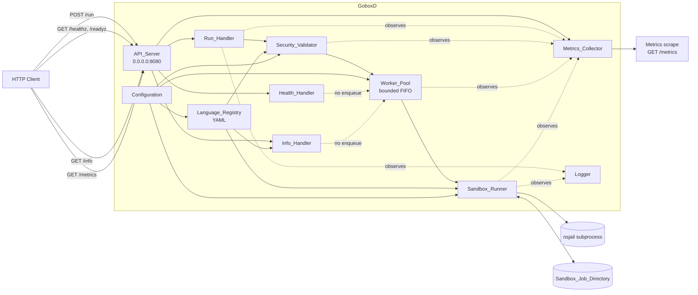
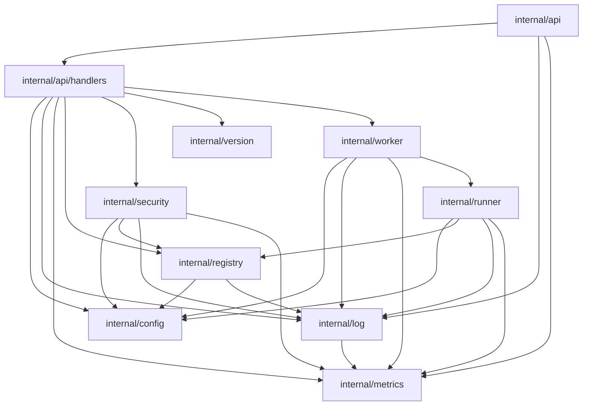
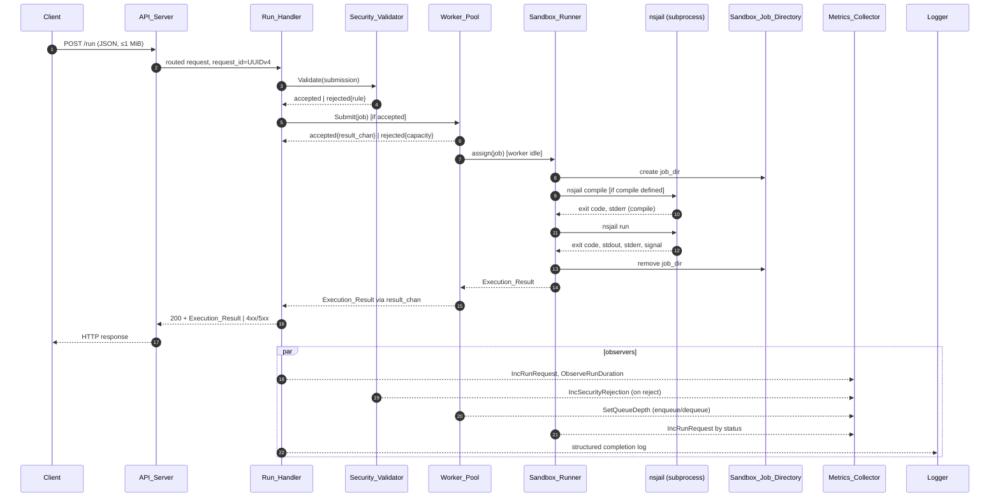

# Design Document

## Overview

The product of this feature is **a single design document**, `docs/architecture.md`, that fully specifies the GoboxD service architecture. No `.go` source files, no infrastructure files, and no executable code are produced by this feature (REQ-1, REQ-2.3).

This `design.md` is therefore the *spec-level* design: it defines

1. The architecture that `docs/architecture.md` will describe — components, packages, data flow, request lifecycle, NsJail invocation model, configuration, observability, testing strategy, and phased delivery — in enough fidelity that `docs/architecture.md` can be written by mechanical expansion of the sections below.
2. The structural template that `docs/architecture.md` must conform to so it satisfies the deliverable acceptance criteria in REQ-1, REQ-2, REQ-15 through REQ-20.
3. The correctness properties the architecture must support, traceable back to the requirements.

### Goals (traced to requirements)

| Goal | Requirements |
| --- | --- |
| Deliver `docs/architecture.md` as the sole artifact | REQ-1.1, REQ-2.3 |
| Capture folder structure, package design, data flow, request lifecycle, phases, scope | REQ-1.2 .. REQ-1.7 |
| Declare non-goals (Dockerfile/docker-compose.yml/Makefile, container build/runtime, NsJail availability, port exposure) and forbid Go code in the document | REQ-2.1 .. REQ-2.5 |
| Specify HTTP API surface (`POST /run`, `GET /healthz`, `GET /readyz`, `GET /info`) on `0.0.0.0:8080` with full status-code semantics and 1 MiB body cap | REQ-3 |
| Specify `POST /run` behaviour: enqueue, validation, status mapping, cleanup | REQ-4 |
| Specify health/readiness semantics including shutdown behaviour | REQ-5 |
| Specify `/info` shape and forbidden fields | REQ-6 |
| Specify YAML language registry, including failure modes and an "add-a-language" worked example | REQ-7, REQ-8 |
| Specify bounded Worker_Pool with FIFO queue, drain timeout (>0 and =0) | REQ-9 |
| Specify the NsJail invocation: argument template, namespaces, rlimits, mounts, I/O caps, deterministic status mapping | REQ-10 |
| Specify the Security_Validator rule catalog | REQ-11 |
| Specify the Metrics catalog and exposition mechanism | REQ-12 |
| Specify the Configuration table including precedence and validation | REQ-13 |
| Specify structured observability (UUIDv4, ISO 8601, redaction) | REQ-14 |
| Specify folder/package/data-flow/lifecycle deliverables and traceability | REQ-15, REQ-16, REQ-17, REQ-18 |
| Specify ≥3 phases with deliverables, gates, dependencies | REQ-19 |
| Specify unit-vs-integration testing strategy, build-tag selector, per-language and per-failure-mode scenarios | REQ-20 |

### Scope of this design

In scope:

- Content and structure of `docs/architecture.md`.
- The runtime architecture it describes for code under `cmd/goboxd/`, `internal/`, `docs/`, `tests/` (REQ-1.7).

Out of scope (REQ-2.1, REQ-2.2):

- `Dockerfile`, `docker-compose.yml`, `Makefile` (must not be created, modified, renamed, or deleted).
- Container image build, container runtime, NsJail binary availability, network port exposure (pre-existing prerequisites).
- Any `.go`, `.mod`, or `.sum` file (REQ-2.3).

## Architecture

### Document architecture (the deliverable)

`docs/architecture.md` is laid out in the following ordered sections. Every required acceptance criterion in REQ-1, REQ-2, REQ-15 through REQ-20 is mapped to exactly one section so a reviewer can verify completeness by section index.

| § | Section in `docs/architecture.md` | Satisfies |
| --- | --- | --- |
| 1 | Scope | REQ-1.7 |
| 2 | Non-Goals | REQ-2.1, REQ-2.2, REQ-2.3 |
| 3 | High-Level Overview (component diagram) | REQ-1 (framing) |
| 4 | Folder Structure | REQ-1.2, REQ-15 |
| 5 | Package Design (per-package responsibility, exported surface, dependencies) | REQ-1.3, REQ-16 |
| 6 | Component Catalog (Responsibilities / Interfaces / Interactions per REQ-2.4) | REQ-2.4 |
| 7 | HTTP API Reference (per-endpoint shape and status codes) | REQ-3.5, REQ-6 |
| 8 | Data Flow (`POST /run`) | REQ-1.4, REQ-17 |
| 9 | Request Lifecycle (`POST /run`, plus `/healthz`, `/readyz`, `/info`) | REQ-1.5, REQ-18 |
| 10 | Worker_Pool Design | REQ-9 |
| 11 | Sandbox Runner & NsJail Invocation Template | REQ-10 |
| 12 | Language Registry & YAML Schema (with `py3`, `cpp`, third-language worked example) | REQ-7, REQ-8 |
| 13 | Security_Validator Rule Catalog | REQ-11 |
| 14 | Metrics Catalog | REQ-12 |
| 15 | Configuration Reference | REQ-13 |
| 16 | Observability & Logging | REQ-14 |
| 17 | Testing Strategy | REQ-20 |
| 18 | Implementation Phases | REQ-1.6, REQ-19 |
| 19 | Component → Folder Traceability Table | REQ-15.6, REQ-15.7 |

Every component referenced in the data flow (§8) and lifecycle (§9) must be defined in §6 and listed in §19, satisfying REQ-15.6, REQ-15.7, and REQ-17.2.

### Runtime architecture (the system being described)

GoboxD is a single Go binary serving four HTTP endpoints on `0.0.0.0:8080` (REQ-3.6). It receives JSON `Code_Submission`s, validates them, dispatches accepted submissions to a bounded `Worker_Pool`, and drives a per-job `Sandbox_Runner` that invokes `nsjail` as a child process. Side-channel components (`Metrics_Collector`, `Logger`) observe the request without altering its result.



Solid arrows represent request-driven control/data flow. Dotted arrows are pure side effects (metrics emission, logging) that do not modify the request, response, or sandbox state (REQ-17.6, REQ-12.5, REQ-14.6).

## Components and Interfaces

Per REQ-2.4, every component below is described using exactly the three subsections **Responsibilities**, **Interfaces**, **Interactions**. No Go source code is used; "interfaces" are described as named operations with input/output shapes.

### API_Server

**Responsibilities.** Owns the HTTP listener bound to `0.0.0.0:8080` (REQ-3.6). Routes incoming requests to the correct handler by exact path match. Enforces method allow-lists and the 1 MiB request body limit on `POST /run` (REQ-3.7, REQ-3.8, REQ-3.11). Returns HTTP 404 for unrecognised paths and HTTP 405 for unsupported methods on recognised paths (REQ-3.7, REQ-3.8, REQ-3.9). Initiates graceful shutdown on OS termination signal and signals the `Worker_Pool` to drain (REQ-5.8, REQ-9.7, REQ-9.8, REQ-9.9). Exposes a metrics scrape endpoint hosted by the `Metrics_Collector` (REQ-12.6).

**Interfaces.**

- `Start(addr) -> listening | startup_error` — binds the listener; on bind failure terminates with non-zero exit.
- `Route(method, path) -> handler | 404 | 405` — pure mapping: `POST /run`→Run_Handler, `GET /healthz`,`GET /readyz`→Health_Handler, `GET /info`→Info_Handler, `GET /metrics`→Metrics_Collector exposition, anything else→404, recognised path with wrong method→405 with `Allow` header.
- `Shutdown(reason) -> drained | drain_timed_out` — orchestrates `Worker_Pool.Drain` then closes the listener.

**Interactions.** Receives configuration (`API_BIND_ADDR`, body size cap) from `Configuration`. Delegates execution to `Run_Handler`/`Health_Handler`/`Info_Handler`. Notifies `Health_Handler` of shutdown state so `/readyz` flips to 503 while `/healthz` continues to return 200 until the listener is closed (REQ-5.8). Emits no business logic itself; failures from handlers map to HTTP 500 only when the failure is unexpected (REQ-3.9).

### Run_Handler

**Responsibilities.** Executes the `POST /run` lifecycle (REQ-4, REQ-18). Decodes the JSON `Code_Submission`, calls `Security_Validator`, enqueues to the `Worker_Pool`, awaits the `Execution_Result`, and emits the JSON response. Owns request-scoped state: request UUIDv4, `Sandbox_Job_Directory` path, deadline. Guarantees `Sandbox_Job_Directory` removal regardless of outcome (REQ-4.9).

**Interfaces.**

- `Handle(http_request) -> http_response` where the response carries either a 200 with `Execution_Result` or a documented non-2xx error.
- `EnsureCleanup(job_dir) -> ok | cleanup_failed` invoked from a deferred path; cleanup failure is logged and surfaced via metrics but does not change the response code (REQ-4.10).

**Interactions.** Reads from `Configuration` (max source size, max stdin size, default per-language ceilings, max body size). Calls `Security_Validator.Validate(submission)` (REQ-11.6, REQ-11.7). On accept, calls `Worker_Pool.Submit(job)`; on capacity rejection returns 429 (REQ-4.5, REQ-9.3). Receives `Execution_Result` from the `Worker_Pool` job context. Records request count, status, duration to `Metrics_Collector` (REQ-12.1, REQ-12.2). Writes one structured log entry on completion (REQ-14.1, REQ-14.7).

### Health_Handler

**Responsibilities.** Serves `GET /healthz` (liveness) and `GET /readyz` (readiness) within 100 ms and 200 ms nominal SLAs respectively (REQ-5.1, REQ-5.2). Never enqueues to `Worker_Pool`, never spawns NsJail, never holds locks shared with `Run_Handler` (REQ-5.6). Method-not-GET returns 405 (REQ-5.7). Returns 503 from `/readyz` while shutdown is in progress, but 200 from `/healthz` until the listener closes (REQ-5.8).

**Interfaces.**

- `Live() -> 200 | (never else while listener is up)`.
- `Ready() -> 200 | 503{failed_components[]}` enumerates *every* failing readiness condition (REQ-5.5).

**Interactions.** Reads boolean readiness signals from `Language_Registry` (loaded, error-free), `Worker_Pool` (reached configured min worker count), `Sandbox_Runner` (NsJail binary exists and is executable at the configured path) (REQ-5.2, REQ-5.3, REQ-5.4). Reads shutdown flag from `API_Server`. Emits no metrics that depend on the request body. Logs nothing per request (only failure events).

### Info_Handler

**Responsibilities.** Serves `GET /info` within 500 ms (REQ-6.1) returning service name, build version, registered language identifiers (possibly empty), and configured `Worker_Pool` size. Never includes secrets, file paths, or values derived from any `Code_Submission` (REQ-6.2). Never enqueues (REQ-6.3). Method-not-GET returns 405 (REQ-6.4).

**Interfaces.**

- `Info() -> {service_name, version, languages[], worker_pool_size}`.

**Interactions.** Reads service name and version from `internal/version` (compile-time constants; for purposes of this document, "build version" is sourced from a build-tagged constant string). Reads language identifier list from `Language_Registry`. Reads pool size from `Worker_Pool` configuration snapshot.

### Language_Registry

**Responsibilities.** Loads `Language_Definition`s from a YAML file at startup and exposes them by exact case-sensitive identifier (REQ-7.1, REQ-7.5). Validates required fields per definition; rejects duplicate identifiers; treats absence of a compile command as "skip compile step" (REQ-7.4, REQ-7.7, REQ-8.3). Immutable after load.

**Interfaces.**

- `Load(path) -> ready | startup_error` — on any error, GoboxD exits non-zero with a log entry naming the path and reason (REQ-7.3, REQ-7.4, REQ-7.7, REQ-13.7).
- `Get(language_id) -> Language_Definition | not_found` — distinguishable not-found result; never mutates state (REQ-7.5).
- `List() -> [language_id]` — used by `Info_Handler` and readiness.

**Interactions.** Read at startup from path supplied by `Configuration`. Read at request time by `Security_Validator` (membership check) and by `Sandbox_Runner` (compile/run command lookup, default `Resource_Limits`). Read at info time by `Info_Handler`.

### Worker_Pool

**Responsibilities.** Bounds concurrent jobs to the configured maximum (1 to 1024) and queues additional submissions in a FIFO of bounded length (0 to 10000) (REQ-9.1, REQ-9.2, REQ-9.4). Rejects on capacity exhaustion immediately, even if a worker becomes idle moments later (REQ-9.3). Performs graceful drain on shutdown for the configured drain timeout (0 to 3600 s) (REQ-9.7, REQ-9.8, REQ-9.9). Validates configuration at startup; invalid values cause startup failure (REQ-9.6, REQ-13.6).

**Interfaces.**

- `Submit(job) -> accepted{result_chan} | rejected{capacity_exhausted}` — synchronous accept/reject decision.
- `Drain(timeout) -> drained{count} | timed_out{drained, cancelled}` — drain semantics depend on `timeout`: 0 cancels in-flight immediately and discards queued; >0 waits up to timeout then cancels remainder (REQ-9.7, REQ-9.8, REQ-9.9).
- `QueueDepth() -> non_negative_int` — read by `Metrics_Collector`.

**Interactions.** Read configuration (`WORKER_POOL_SIZE`, `WORKER_POOL_QUEUE_LEN`, `WORKER_POOL_DRAIN_TIMEOUT_S`) from `Configuration`. Pull jobs in FIFO order; assign to idle worker; worker calls `Sandbox_Runner.Run(job)`. On enqueue and dequeue, update queue-depth gauge through `Metrics_Collector` (REQ-12.3).

### Sandbox_Runner

**Responsibilities.** For each accepted job, creates the `Sandbox_Job_Directory`, materialises the source file, and invokes `nsjail` as a child subprocess for the compile step (if the language defines one) and the run step (REQ-10.1, REQ-10.2). Enforces `Resource_Limits` via `nsjail` flags (REQ-10.3). Bind-mounts the job directory read-write and toolchain paths read-only (REQ-10.4). Captures stdout/stderr up to 1 MiB each, feeds stdin up to 1 MiB, and marks truncation in the result (REQ-10.5). Classifies the outcome to a single `Execution_Result` status using the deterministic mapping in REQ-10.6. Returns `INTERNAL_ERROR` if `nsjail` cannot be located, fails to launch within 5 s, or exits without a parseable outcome, with no partial stdout/stderr returned (REQ-10.7). Always removes `Sandbox_Job_Directory` before returning, and reports cleanup failure separately (REQ-4.9, REQ-4.10).

**Interfaces.**

- `Run(job) -> Execution_Result` — full compile-then-run sequence; `job` carries language definition, source, stdin, effective `Resource_Limits`, and request id.
- `CleanupOnly(job_dir) -> ok | cleanup_failed` — invoked from deferred path on panic/timeout/shutdown.

**Interactions.** Reads compile and run commands and default `Resource_Limits` from `Language_Registry`. Reads `nsjail` binary path and bind-mount allow-list from `Configuration`. Spawns `nsjail` as a child process. Writes/reads the `Sandbox_Job_Directory` on the host filesystem. Records sandbox outcome counters via `Metrics_Collector`. Emits structured logs at completion and on failure (REQ-14.1, REQ-14.5).

**Workspace Isolation.** For every accepted job, `Sandbox_Runner` creates a per-request directory at `<SANDBOX_ROOT_DIR>/job-<UUIDv4>`, where the UUIDv4 is the request's `request_id` (REQ-24.1, REQ-24.2). The UUIDv4 is generated from a cryptographically secure source by `Run_Handler` and provides ≥128 bits of entropy, ensuring the path is non-guessable and that no two requests — concurrent or sequential — can share a workspace path or observe each other's contents (REQ-24.3).

The runner records the workspace path it created in the `Job` context at creation time. **Ownership invariant:** every operation that writes to or removes a `Sandbox_Job_Directory` first compares the target path to the path recorded in the `Job` context for the current request. If the paths do not match, `Sandbox_Runner` refuses the operation, returns an `Execution_Result` with `status = INTERNAL_ERROR`, increments `goboxd_workspace_isolation_violation_total`, and emits an ERROR log entry with fields `event="workspace_isolation_violation"`, `request_id`, `expected_path`, `received_path` (REQ-24.5).

**Cleanup paths.** The deferred cleanup is owned by `Run_Handler` and runs from a `defer`-style path on every termination mode of the request lifecycle: success, compile failure, runtime failure, classified `INTERNAL_ERROR`, execution timeout, runtime panic, shutdown signal, and request cancellation (REQ-24.4). Cleanup invokes `Sandbox_Runner.CleanupOnly(job_dir)`, which itself enforces the ownership invariant before removing.

**Orphan reaper.** Cleanup failures are recovered by the periodic orphan reaper described in §9 ("Cleanup failure recovery"). The reaper uses `SANDBOX_ORPHAN_TTL_S` to decide which `<SANDBOX_ROOT_DIR>/job-*` entries are stale and removes them; each successful removal increments `goboxd_orphan_workspace_reaped_total`.

### Security_Validator

**Responsibilities.** Validates an incoming `Code_Submission` against the rule catalog before any sandbox is allocated (REQ-11.6). Produces an accept-or-reject decision within 50 ms at the 99th percentile (REQ-11.7). Rejection reasons are structured (rule name + offending value + configured limit, where applicable) (REQ-11.1 .. REQ-11.5). Decision is deterministic for a given `(submission, configuration)` pair.

**Interfaces.**

- `Validate(submission) -> accepted | rejected{rule_name, detail}` where `rule_name ∈ {source_size_exceeded, stdin_size_exceeded, language_not_registered, resource_limit_exceeded, malformed_submission}`.

**Interactions.** Reads thresholds from `Configuration`. Reads language membership from `Language_Registry`. On rejection, records a counter increment to `Metrics_Collector` partitioned by `rule_name` (REQ-12.4) and `Run_Handler` emits a structured rejection log entry (REQ-14.7). Never enqueues, never spawns sandbox.

### Metrics_Collector

**Responsibilities.** Records counters, gauges, and a histogram per the metrics catalog (REQ-12.1 .. REQ-12.4). Exposes Prometheus text format at `GET /metrics` with maximum staleness ≤1 s between metric update and exposition (REQ-12.6). Failure to record a metric never alters the originating request's `Execution_Result`; instead it increments an internal `dropped_metrics_total` and surfaces a structured log warning (REQ-12.5, REQ-14.6).

**Interfaces.**

- `IncRunRequest(language, status)`, `ObserveRunDuration(seconds)`, `SetQueueDepth(n)`, `IncSecurityRejection(rule_name)`, `IncDroppedMetric(reason)`, `IncDroppedLog(reason)` — all best-effort, no return value visible to callers.
- `Expose(http_response_writer)` — produces the Prometheus exposition text.

**Interactions.** Hooked from `Run_Handler` (request count, duration), `Worker_Pool` (queue depth), `Security_Validator` (rejections), `Sandbox_Runner` (sandbox outcomes by status), `Logger` (dropped log counter). Read via `API_Server` route for `GET /metrics`.

### Configuration

**Responsibilities.** Loads, validates, and exposes immutable runtime configuration. Resolves precedence between environment variables and YAML overrides (env-var wins) (REQ-13.2). Rejects missing/out-of-range/unparseable values at startup with a non-zero exit and a log entry naming the offending key (REQ-13.6).

**Interfaces.**

- `Load(env, yaml_path?) -> Configuration | startup_error`.
- `Get(key) -> typed_value` — accessed once at startup by every consumer; consumers receive a snapshot rather than re-reading at request time.

**Interactions.** Read once at startup by `API_Server`, `Language_Registry`, `Worker_Pool`, `Sandbox_Runner`, `Security_Validator`, `Metrics_Collector`, `Logger`. After startup, configuration is treated as constant for the lifetime of the process.

### Logger

**Responsibilities.** Emits structured (JSON) log entries with UUIDv4 request identifiers, ISO 8601 UTC timestamps with millisecond precision, and levels (DEBUG, INFO, WARN, ERROR) (REQ-14.1, REQ-14.7). Redacts `Code_Submission` source code, stdin, stdout, and stderr from every entry at INFO and above; permits sandbox argument lists at DEBUG but never the user payload (REQ-14.4, REQ-14.5). Failure to emit increments a dropped-log counter via `Metrics_Collector` and never alters the request's result (REQ-14.6).

**Interfaces.**

- `Info(event, fields)`, `Warn(event, fields)`, `Error(event, fields)`, `Debug(event, fields)` — structured key/value emission.
- `WithRequest(request_id) -> Logger` — derived logger that auto-injects `request_id`.

**Interactions.** Used by `API_Server` (startup, shutdown), `Run_Handler` (per-request completion and rejection), `Sandbox_Runner` (per-step completion, NsJail failures), `Worker_Pool` (drain summary), `Configuration` (startup validation outcomes).

## Data Models

The architecture document specifies the following data shapes. These are JSON wire shapes and configuration shapes; per REQ-2.4 they are described as named fields with types and ranges, not as Go declarations.

### `Code_Submission` (request body for `POST /run`)

| Field | Type | Required | Range / Validation |
| --- | --- | --- | --- |
| `language` | string | yes | Exact match in `Language_Registry` (REQ-11.3) |
| `source` | string (UTF-8) | yes | Non-empty; size ≤ `MAX_SOURCE_SIZE_BYTES` (default 1 MiB; range 1 .. 10,485,760) (REQ-11.1, REQ-13.5) |
| `stdin` | string (UTF-8) | no | size ≤ `MAX_STDIN_SIZE_BYTES` (default 1 MiB; range 0 .. 10,485,760) (REQ-11.2, REQ-13.5) |
| `resource_limits` | object | no | Per-field overrides; each must be ≤ per-language ceiling (REQ-11.4) |
| `resource_limits.wall_time_s` | integer | no | 1 .. 60 (REQ-10.3) |
| `resource_limits.cpu_time_s` | integer | no | 1 .. 60 (REQ-10.3) |
| `resource_limits.memory_mb` | integer | no | 16 .. 1024 (REQ-10.3) |
| `resource_limits.process_count` | integer | no | 1 .. 64 (REQ-10.3) |
| `resource_limits.output_size_mb` | integer | no | 1 .. 64 (REQ-10.3) |

Total request body size must be ≤ 1 MiB; oversize → HTTP 400 (REQ-3.11). Content-Type must be `application/json`; otherwise → HTTP 400 (REQ-3.10).

### `Execution_Result` (response body for `POST /run`)

| Field | Type | Notes |
| --- | --- | --- |
| `status` | enum string | One of `OK`, `COMPILATION_ERROR`, `RUNTIME_ERROR`, `TIME_LIMIT_EXCEEDED`, `MEMORY_LIMIT_EXCEEDED`, `INTERNAL_ERROR` (REQ-4.6 .. REQ-4.8, REQ-10.6) |
| `exit_code` | integer or sentinel | Process exit code; sentinel `-1` when terminated by signal (REQ-4.2) |
| `stdout` | string | Captured up to `STDOUT_CAPTURE_LIMIT_BYTES` (default 1 MiB) (REQ-4.2, REQ-10.5) |
| `stderr` | string | Captured up to `STDERR_CAPTURE_LIMIT_BYTES` (default 1 MiB) (REQ-4.2, REQ-10.5) |
| `stdout_truncated` | boolean | True if capture limit reached (REQ-10.5) |
| `stderr_truncated` | boolean | True if capture limit reached (REQ-10.5) |
| `duration_ms` | integer | Wall-clock duration of the run step, 0 .. 2,147,483,647 (REQ-4.2, REQ-14.1) |
| `request_id` | UUID v4 string | Echoed for correlation (REQ-14.1) |

### `Language_Definition` (entry in YAML registry)

| Field | Type | Required | Notes |
| --- | --- | --- | --- |
| `id` | string | yes | Case-sensitive; unique across the file (REQ-7.5, REQ-7.7) |
| `source_filename` | string | yes | E.g. `main.py`, `main.cpp` |
| `binary_filename` | string | conditional | Required when `compile` present and run command needs the artifact (REQ-8.4) |
| `compile.command` | string | no | Absent → skip compile step (REQ-8.3) |
| `compile.args` | list[string] | no | Templated with placeholders (see §11) |
| `compile.limits.wall_time_s` | integer | conditional | Required when `compile` present |
| `compile.limits.cpu_time_s` | integer | conditional | |
| `compile.limits.memory_mb` | integer | conditional | |
| `compile.limits.process_count` | integer | conditional | |
| `compile.limits.output_size_mb` | integer | conditional | |
| `run.command` | string | yes | Non-empty (REQ-7.2) |
| `run.args` | list[string] | yes | May be empty list |
| `run.limits.wall_time_s` | integer | yes | (REQ-8.1, REQ-8.2) |
| `run.limits.cpu_time_s` | integer | yes | |
| `run.limits.memory_mb` | integer | yes | |
| `run.limits.process_count` | integer | yes | |
| `run.limits.output_size_mb` | integer | yes | |

### `Job` (in-memory job context)

| Field | Type | Notes |
| --- | --- | --- |
| `request_id` | UUID v4 | Set by `Run_Handler` |
| `language_def` | `Language_Definition` | Resolved by `Language_Registry.Get` |
| `source` | string | Sanitised by `Security_Validator` |
| `stdin` | string | Truncated to 1 MiB cap (REQ-10.5) |
| `effective_limits` | `Resource_Limits` | Per-language defaults overridden by request, capped by per-language ceilings |
| `job_dir` | filesystem path | `Sandbox_Job_Directory`, owned by job |
| `deadline` | timestamp | Wall-clock deadline = start + `effective_limits.wall_time_s` |
| `result_chan` | channel | One-shot; receives `Execution_Result` from worker |

### `Configuration` (startup snapshot — field listing)

See §15 of `docs/architecture.md` (Configuration Reference table) below.


## Folder Structure (plan for `docs/architecture.md` §4)

The architecture document presents the layout below as a directory tree (REQ-15.1, REQ-15.2, REQ-15.3, REQ-15.4, REQ-15.5).

```text
.
├── cmd/
│   └── goboxd/                  Binary entry point. Wires Configuration,
│                                Logger, Language_Registry, Worker_Pool,
│                                Sandbox_Runner, Metrics_Collector and
│                                API_Server, then runs until shutdown.
├── internal/
│   ├── api/                     API_Server, routing, method/body limits,
│   │                            request decoding/encoding helpers.
│   ├── api/handlers/            Run_Handler, Health_Handler, Info_Handler.
│   ├── config/                  Configuration loader, env+YAML precedence,
│   │                            range validation, startup snapshot.
│   ├── log/                     Logger: structured JSON, UUIDv4 ids,
│   │                            ISO 8601 UTC ms timestamps, redaction.
│   ├── metrics/                 Metrics_Collector: counters, gauge,
│   │                            histogram, Prometheus exposition.
│   ├── registry/                Language_Registry: YAML load, validation,
│   │                            Get/List, immutable snapshot.
│   ├── runner/                  Sandbox_Runner: NsJail argv builder,
│   │                            child process orchestration, status
│   │                            classification, cleanup.
│   ├── security/                Security_Validator: rule catalog,
│   │                            structured rejection reasons.
│   ├── version/                 Build-time service name and version
│   │                            constants used by Info_Handler.
│   └── worker/                  Worker_Pool: bounded FIFO queue,
│                                drain semantics, capacity rejection.
├── docs/
│   ├── architecture.md          THE DELIVERABLE: this document.
│   └── (no other files added by this feature)
└── tests/
    └── integration/             End-to-end tests selected by build tag
                                  `integration`; depend on NsJail.
```

`.gitkeep` files at the root of currently-empty `internal/`, `docs/`, and `tests/` are pre-existing scaffolding. They are not enumerated in REQ-15.4's `docs/` listing because that requirement asks for files added by this feature; the only such file is `architecture.md`.

### Test classification rule (REQ-15.5, REQ-20.3)

Exactly one mechanism distinguishes unit tests from integration tests in this codebase:

- **Unit tests** live alongside the source under `internal/<package>/` in files named `*_test.go` and have **no Go build tag** (REQ-20.1).
- **Integration tests** live under `tests/integration/` in files named `*_test.go` and carry the `//go:build integration` build tag (REQ-20.2, REQ-20.3). The existing `make integration` target invokes `go test -tags=integration ./tests/...`, so the build tag is what `make integration` selects (REQ-20.3).

This rule is non-overlapping: a file under `internal/` with the `integration` tag is forbidden by `docs/architecture.md`, and a file under `tests/integration/` without the tag is treated as malformed and must be fixed.

## Package Design (plan for `docs/architecture.md` §5)

For every package under `internal/`, `docs/architecture.md` will state: responsibility (1–3 sentences naming inputs, outputs, owned concern, REQ-16.1), exported identifiers with one-line descriptions (REQ-16.2; for packages with no exported surface a "no exported identifiers" note, REQ-16.3), the complete set of `internal/` packages it imports (or "no internal dependencies", REQ-16.4), and its test coverage classification (REQ-16.7).

The package set and its dependencies (REQ-16.4, REQ-16.5):

| Package | Imports (`internal/`) | Test coverage class |
| --- | --- | --- |
| `internal/version` | (no internal dependencies) | not covered by automated tests (compile-time constants only) |
| `internal/log` | `internal/metrics` (only for dropped-log counter) | unit tests in `internal/log/` |
| `internal/config` | (no internal dependencies) | unit tests in `internal/config/` |
| `internal/metrics` | (no internal dependencies) | unit tests in `internal/metrics/` |
| `internal/registry` | `internal/config`, `internal/log` | unit tests in `internal/registry/` |
| `internal/security` | `internal/config`, `internal/registry`, `internal/log`, `internal/metrics` | unit tests in `internal/security/` |
| `internal/runner` | `internal/config`, `internal/registry`, `internal/log`, `internal/metrics` | integration tests in `tests/integration/` (NsJail required) plus unit tests for the argv builder and status classifier in `internal/runner/` |
| `internal/worker` | `internal/config`, `internal/log`, `internal/metrics`, `internal/runner` | unit tests in `internal/worker/` |
| `internal/api/handlers` | `internal/config`, `internal/log`, `internal/metrics`, `internal/registry`, `internal/security`, `internal/version`, `internal/worker` | unit tests in `internal/api/handlers/` |
| `internal/api` | `internal/api/handlers`, `internal/log`, `internal/metrics` | unit tests in `internal/api/` |

The `metrics` package is at the bottom of the graph (alongside `version` and `config`) so every other package may depend on it for best-effort recording without creating cycles. The `log` package depends only on `metrics` so it can increment the dropped-log counter without re-entering the logger.

### Dependency graph



**Acyclicity.** The graph contains zero cycles (REQ-16.5). A topological order is `version, config, metrics, log, registry, security, runner, worker, handlers, api`. Because every edge in the table above appears as exactly one downward arrow in this order, no edge can close a cycle. If any future change introduces a cycle, REQ-16.6 obliges `docs/architecture.md` to identify the cycle and the refactor required to break it.

### Component → Folder traceability (REQ-15.6)

Every component named in §6 of the architecture document maps to exactly one folder path in the layout above:

| Component | Folder |
| --- | --- |
| API_Server | `internal/api/` |
| Run_Handler | `internal/api/handlers/` |
| Health_Handler | `internal/api/handlers/` |
| Info_Handler | `internal/api/handlers/` |
| Language_Registry | `internal/registry/` |
| Worker_Pool | `internal/worker/` |
| Sandbox_Runner | `internal/runner/` |
| Security_Validator | `internal/security/` |
| Metrics_Collector | `internal/metrics/` |
| Configuration | `internal/config/` |
| Logger | `internal/log/` |
| Build version constants | `internal/version/` |
| Binary entry point (wiring only) | `cmd/goboxd/` |

Three handler components share `internal/api/handlers/` as their folder; this still satisfies REQ-15.6 (every component has *exactly one* folder; one folder may host multiple components).

## HTTP API Reference (plan for `docs/architecture.md` §7)

Per REQ-3.5 and REQ-6, the architecture document specifies request shape, response shape, and status codes for every endpoint.

| Endpoint | Method | Headers | Request body | Response body | Status codes |
| --- | --- | --- | --- | --- | --- |
| `/run` | POST | `Content-Type: application/json` (required) | JSON `Code_Submission` (≤1 MiB) | JSON `Execution_Result` (`Content-Type: application/json`) | 200 success; 400 malformed/invalid/oversize source/oversize body/bad Content-Type/unknown language/security rule violation; 405 wrong method (`Allow: POST`); 429 capacity exhausted; 500 unexpected internal failure |
| `/healthz` | GET | (none required) | (none) | JSON `{status: "ok"}` (`Content-Type: application/json`) | 200 while listener is up; 405 wrong method (`Allow: GET`) |
| `/readyz` | GET | (none required) | (none) | JSON `{ready: bool, failed_components?: [{component, reason}]}` | 200 ready; 503 not ready; 405 wrong method (`Allow: GET`) |
| `/info` | GET | (none required) | (none) | JSON `{service_name, version, languages: [], worker_pool_size}` | 200; 405 wrong method (`Allow: GET`) |
| `/metrics` | GET | (none required) | (none) | Prometheus text format (`Content-Type: text/plain; version=0.0.4`) | 200 |

Any path other than `/run`, `/healthz`, `/readyz`, `/info`, `/metrics` returns HTTP 404 (REQ-3.7). HTTP 404 is reserved for unrecognised paths (REQ-3.9).

## Data Flow for `POST /run` (plan for `docs/architecture.md` §8)

The architecture document presents the data flow as a numbered narrative tied to a sequence diagram (REQ-17.1). Each step lists input, output, persistent/transient state, and the failure modes that terminate the flow at that step with their HTTP status codes (REQ-17.3, REQ-17.4). Side-effect components (`Metrics_Collector`, `Logger`) are shown but never alter recorded inputs/outputs/state (REQ-17.6).



### Numbered narrative

| # | Component | Input | Output | State | Failure mode → status |
| --- | --- | --- | --- | --- | --- |
| 1 | API_Server | TCP bytes; method, path, headers | Routed handler invocation | Per-connection request id (UUIDv4) generated here | Body > 1 MiB → 400 (REQ-3.11); wrong Content-Type → 400 (REQ-3.10); unknown path → 404 (REQ-3.7); wrong method → 405 (REQ-3.8) |
| 2 | Run_Handler | Raw request body | Decoded `Code_Submission` | Request scope created | Malformed JSON / missing required field → 400 (REQ-4.11) |
| 3 | Security_Validator | `Code_Submission` | accept or rejection reason | (none persistent; cheap in-memory work) | source_size_exceeded → 400 (REQ-4.4, REQ-11.1); stdin_size_exceeded → 400 (REQ-11.2); language_not_registered → 400 (REQ-4.3, REQ-11.3); resource_limit_exceeded → 400 (REQ-11.4); malformed_submission → 400 (REQ-11.5) |
| 4 | Worker_Pool | accepted submission | accept/reject + result channel | Queue depth gauge updated as side effect (REQ-12.3) | capacity_exhausted → 429 (REQ-4.5, REQ-9.3) |
| 5 | Sandbox_Runner | Job + language def + effective limits | filled `Execution_Result` | Creates `job_dir` on host fs; spawns child process | Compile failure → status `COMPILATION_ERROR` returned via 200 (REQ-4.8); NsJail invocation failure → status `INTERNAL_ERROR` via 200 with structured indicator (REQ-10.7) |
| 6 | Sandbox_Runner (run step) | Compiled artifact + stdin | exit code, stdout, stderr (truncated to caps) | `job_dir` populated | Wall/CPU time limit → status `TIME_LIMIT_EXCEEDED` via 200 (REQ-4.6, REQ-10.6); memory exceeded → status `MEMORY_LIMIT_EXCEEDED` if attributable, else `RUNTIME_ERROR` (REQ-4.7); other non-zero exit/signal → `RUNTIME_ERROR` (REQ-10.6) |
| 7 | Sandbox_Runner (cleanup) | `job_dir` path | ok or cleanup_failed | `job_dir` removed | Cleanup failure → response still 200 with original `Execution_Result`; cleanup error logged and counter incremented (REQ-4.10) |
| 8 | Run_Handler | `Execution_Result` | HTTP 200 JSON response | (none) | Unexpected panic in handler → 500 (REQ-3.9); cleanup still runs in deferred path (REQ-18.5) |
| 9 | Metrics_Collector / Logger | observation events | metric updates / log lines | metric registry / log sink | Metric or log emission failure does NOT alter response (REQ-12.5, REQ-14.6) |

### Error path example (REQ-17.5)

`POST /run` with `language: "rust"` not in registry: step 1 succeeds (body well-formed, ≤1 MiB, JSON Content-Type); step 2 decodes successfully; step 3 returns `rejected{language_not_registered}`; flow terminates at step 3 with HTTP 400 carrying the rejection reason. Steps 4–7 do not execute. `Metrics_Collector.IncSecurityRejection("language_not_registered")` is invoked as a side effect. `Logger` emits one rejection log entry with `request_id` and ISO 8601 UTC ms timestamp (REQ-14.7).

## Request Lifecycle (plan for `docs/architecture.md` §9)

### `POST /run` lifecycle (REQ-18.1, REQ-18.2)

The lifecycle is presented as a numbered, ordered sequence with mandatory/conditional flags and a single responsible component per step (REQ-18.4).

| # | Step | M/C | Component | Inputs | Outputs | Predecessor → Successor |
| --- | --- | --- | --- | --- | --- | --- |
| 1 | Receive request, generate `request_id` (UUIDv4) | Mandatory | API_Server | TCP bytes | request_id, decoded headers | (start) → 2 |
| 2 | Decode JSON body (≤1 MiB) | Mandatory | Run_Handler | raw body | `Code_Submission` | 1 → 3 |
| 3 | Security_Validator step | Mandatory (REQ-18.2) | Security_Validator | `Code_Submission` | accept or rejection reason | 2 → 4 (if accepted) or end (if rejected, HTTP 400) |
| 4 | Worker_Pool enqueue step | Mandatory (REQ-18.2) | Worker_Pool | accepted job | result_chan or capacity_exhausted | 3 → 5 (if enqueued) or end (if rejected, HTTP 429) |
| 5 | Sandbox_Job_Directory creation step | Mandatory (REQ-18.2) | Sandbox_Runner | job, request_id | job_dir path | 4 → 6 |
| 6 | Compile step | Conditional (REQ-18.3) | Sandbox_Runner | language def with `compile.command` | compile artifact or `COMPILATION_ERROR` | 5 → 7 if compile defined; 5 → 7 (skipped) if `compile.command` is absent |
| 7 | Run step | Mandatory (REQ-18.2) | Sandbox_Runner | run command, artifact (if any), stdin, effective limits | exit code, stdout, stderr, status | 6 → 8 |
| 8 | Result aggregation step | Mandatory (REQ-18.2) | Sandbox_Runner | run-step outputs + step-1 timer | `Execution_Result` | 7 → 9 |
| 9 | Cleanup step | Mandatory (REQ-18.2) | Sandbox_Runner | job_dir | ok or cleanup_failed | 8 → 10 |
| 10 | Response emission | Mandatory | Run_Handler / API_Server | `Execution_Result` | HTTP 200 + JSON | 9 → end |

The compile step (#6) is the only conditional step. It executes if and only if `language_def.compile.command` is present and non-empty (REQ-8.3, REQ-18.3).

### Cleanup guarantees (REQ-18.5)

The architecture document states the following invariants. The component responsible for honoring them is `Sandbox_Runner`; `Run_Handler` enforces the deferred-cleanup contract that delegates to `Sandbox_Runner.CleanupOnly`.

| Failure mode | Steps guaranteed to execute | Order | Post-conditions |
| --- | --- | --- | --- |
| Execution timeout (wall/CPU exceeded inside `nsjail`) | 7 (terminated by nsjail), 8 (status=`TIME_LIMIT_EXCEEDED`), 9 (cleanup), 10 (response) | 7 → 8 → 9 → 10 | `Sandbox_Job_Directory` removed; `nsjail` child process and all descendants terminated by namespace teardown; HTTP 200 with `TIME_LIMIT_EXCEEDED`. |
| Process panic in `Run_Handler` or `Sandbox_Runner` | 9 (cleanup via deferred call), 10 (HTTP 500) | 9 → 10 | `Sandbox_Job_Directory` removed; any spawned `nsjail` child is killed via context cancellation; HTTP 500 returned. |
| Shutdown signal received during step 5–8 | 7 cancelled; 9 (cleanup); response is HTTP 503 if drain timeout = 0, otherwise the in-flight job completes normally up to the drain timeout, then 7 cancelled and 9 runs (REQ-9.7, REQ-9.8, REQ-9.9). | drain → cancel → 9 → 10 | `Sandbox_Job_Directory` removed; `nsjail` child processes terminated; clients of cancelled in-flight jobs receive HTTP 503; queued jobs receive HTTP 503. |

### Cleanup failure recovery (REQ-18.6)

If step 9 fails, `Run_Handler` still returns the `Execution_Result` from step 8 (HTTP 200) with status as computed (REQ-4.10). The cleanup failure increments a `sandbox_cleanup_failures_total` counter and emits an ERROR log entry with `request_id`, `job_dir`, and OS error. On the next request, the orphan directory is detected by a startup-time and periodic `Sandbox_Runner` reaper that lists the parent jobs directory and removes any directory older than `SANDBOX_ORPHAN_TTL_S` (default 600 s); failure to reap is logged and counted but does not block the new request.

### Non-`/run` lifecycles (REQ-18.7)

| Endpoint | Steps | Property |
| --- | --- | --- |
| `GET /healthz` | (1) API_Server route → (2) Health_Handler.Live → (3) write 200 JSON | No `Sandbox_Job_Directory`, no `Worker_Pool` enqueue, no compile, no run. |
| `GET /readyz` | (1) API_Server route → (2) Health_Handler.Ready (read registry/pool/runner readiness flags + shutdown flag) → (3) write 200 or 503 with enumerated failed components | Same: no sandbox, no enqueue, no compile, no run. |
| `GET /info` | (1) API_Server route → (2) Info_Handler.Info (read version constant + registry list + pool size snapshot) → (3) write 200 JSON | Same: no sandbox, no enqueue, no compile, no run. |

## NsJail Invocation Design (plan for `docs/architecture.md` §11)

### Argument template

The architecture document presents the complete argument template (REQ-10.8). Placeholders surrounded by `{{ … }}` are substituted per request from the sources listed below.

```text
{{ NSJAIL_PATH }}
  --mode o                                # one-shot
  --quiet
  --user 65534 --group 65534              # nobody:nogroup mapped via user namespace
  --hostname goboxd-sandbox
  --cwd /sandbox
  --bindmount {{ JOB_DIR }}:/sandbox      # rw, per-request
  {{ READONLY_BIND_MOUNTS }}              # ro, e.g. /usr:/usr, /lib:/lib, /lib64:/lib64,
                                          #            /bin:/bin, /etc/alternatives:/etc/alternatives
  --tmpfsmount /tmp
  --disable_clone_newcgroup               # left enabled or disabled per kernel; documented in §15
  --disable_proc                          # /proc is not exposed to the sandbox
  --rlimit_as {{ MEMORY_MB }}             # virtual address space cap
  --rlimit_cpu {{ CPU_TIME_S }}
  --rlimit_nproc {{ PROCESS_COUNT }}
  --rlimit_fsize {{ OUTPUT_SIZE_MB }}
  --rlimit_nofile 64
  --time_limit {{ WALL_TIME_S }}          # nsjail wall-clock kill
  --max_cpus 1
  --seccomp_string '{{ SECCOMP_POLICY }}' # default-deny syscall policy; static string
  --really_quiet
  --log /dev/null                         # nsjail's own log; runner separately captures stderr
  --                                      # end of nsjail flags; child argv follows
  {{ CHILD_ARGV }}                        # compile or run command + args, fully resolved
```

### Placeholders

| Placeholder | Source | Validation rule |
| --- | --- | --- |
| `NSJAIL_PATH` | Configuration `NSJAIL_PATH` env (default `/usr/local/bin/nsjail`) | Must exist and be executable; checked at readiness (REQ-5.4) |
| `JOB_DIR` | `Sandbox_Runner` per-request | Must be under `SANDBOX_ROOT_DIR`, must be a fresh directory; rw bind |
| `READONLY_BIND_MOUNTS` | Configuration `SANDBOX_RO_MOUNTS` (list of `host:guest` pairs) | Each host path must exist; defaults documented in §15 |
| `MEMORY_MB` | `Job.effective_limits.memory_mb` | 16 .. 1024 (REQ-10.3) |
| `CPU_TIME_S` | `Job.effective_limits.cpu_time_s` | 1 .. 60 (REQ-10.3) |
| `WALL_TIME_S` | `Job.effective_limits.wall_time_s` | 1 .. 60 (REQ-10.3) |
| `PROCESS_COUNT` | `Job.effective_limits.process_count` | 1 .. 64 (REQ-10.3) |
| `OUTPUT_SIZE_MB` | `Job.effective_limits.output_size_mb` | 1 .. 64 (REQ-10.3) |
| `SECCOMP_POLICY` | Configuration `SANDBOX_SECCOMP_POLICY` (string) | Compiled at startup; non-empty default-deny policy with explicit allow-list |
| `CHILD_ARGV` | `Language_Definition.compile` or `.run`, args expanded with `{{ SOURCE_FILENAME }}`, `{{ BINARY_FILENAME }}`, `{{ STDIN_FILE }}` | Each arg must be non-empty after expansion |

### Namespace flags

The runner ALWAYS passes flags that enable user, PID, mount, network, IPC, and UTS namespace isolation (REQ-10.2). nsjail enables these by default for `--mode o`; the runner additionally passes `--disable_proc` and does not pass `--disable_clone_newuser` / `--disable_clone_newnet` / etc. Networking is disabled via the new network namespace plus no veth setup.

### Resource limit flags (REQ-10.3)

`--time_limit`, `--rlimit_cpu`, `--rlimit_as`, `--rlimit_nproc`, `--rlimit_fsize` map directly to wall, CPU, memory, process, and output limits in `Resource_Limits`. nsjail reports limit hits on its log/stderr, which the runner parses for status classification.

### Bind mounts (REQ-10.4)

| Mount | Mode | Source |
| --- | --- | --- |
| `JOB_DIR` → `/sandbox` | rw | per-request |
| Toolchain root paths (defaults: `/usr`, `/lib`, `/lib64`, `/bin`, `/etc/alternatives`) | ro | configuration `SANDBOX_RO_MOUNTS` |
| `/tmp` | tmpfs | always |

The job directory is the only writable path. Toolchain paths are read-only. `/proc` is not exposed; `/dev` is provided by nsjail's default minimal devfs.

### I/O capture limits (REQ-10.5)

The runner attaches a stdin pipe of up to 1 MiB (sourced from `Code_Submission.stdin`, truncated to that cap before write), and reads stdout and stderr through bounded buffers of 1 MiB each. Bytes beyond the cap are discarded and the corresponding `*_truncated` boolean is set on the `Execution_Result`.

### Deterministic status classification (REQ-10.6)

Inputs to the classifier are: step kind (compile or run), exit code, terminating signal (if any), and parsed nsjail log/stderr indicators.

| Step | Observation | Status |
| --- | --- | --- |
| compile or run | nsjail invocation failed (binary not found, failed to launch within 5 s, exited without parseable outcome) | `INTERNAL_ERROR` (REQ-10.7) |
| compile | exit code = 0 | (proceed to run) |
| compile | exit code ≠ 0 | `COMPILATION_ERROR` (REQ-4.8, REQ-10.6) |
| run | exit code = 0 | `OK` (REQ-10.6) |
| run | nsjail log indicates wall-time/CPU-time/memory limit hit AND limit kind is wall or cpu | `TIME_LIMIT_EXCEEDED` (REQ-4.6) |
| run | nsjail log indicates memory limit hit AND attributable | `MEMORY_LIMIT_EXCEEDED` (REQ-4.7) |
| run | exit code ≠ 0 OR terminated by signal AND not attributable to a specific limit | `RUNTIME_ERROR` (REQ-10.6) |

The classifier is a pure function of its inputs; identical inputs always produce identical outputs across requests (REQ-4.7 deterministic selection rule).

### Filename and Path Safety

Every `Language_Definition.source_filename` and `Language_Definition.binary_filename` must be a simple POSIX basename. The basename validation rule rejects a value if any of the following hold:

- The value contains a path separator: U+002F (`/`) or U+005C (`\`).
- The value contains the parent-directory traversal sequence `..` anywhere — including as the entire string, as a prefix, or embedded.
- The value begins with `/` or any other absolute-path prefix; an absolute path is always rejected.
- The value contains a leading `.` (a deliberate, documented decision: hidden-file basenames are rejected to remove a class of bypass attempts where a definition writes a `.profile`-style file inside the sandbox root that some other component might exec or source). The single exception `.` and `..` themselves are already rejected by the path-separator and traversal rules.
- The value contains any codepoint below 0x20 (ASCII control bytes, including TAB, LF, CR).
- The value contains a NUL byte (0x00).
- The value is the empty string.
- Scope of the rule is **POSIX only**: GoboxD targets a Linux runtime, so Windows reserved device names (e.g. `CON`, `NUL`, `PRN`, `AUX`, `COM1`–`COM9`, `LPT1`–`LPT9`) are out of scope and are not enumerated; `\` is rejected purely as a path separator on POSIX.

A single canonical validator referenced from `internal/security` is the only place this rule is encoded; both call sites import it. The documented location is `internal/security/filename.go::ValidateBasename(name string) error`.

Call sites:

1. **Language_Registry on Load (startup fail-fast).** During `Language_Registry.Load`, every Language_Definition's `source_filename` and `binary_filename` (when present) is passed through the validator. The first failure aborts startup with a non-zero exit code and an emitted ERROR log entry per REQ-21.2 (REQ-21.1, REQ-21.2).
2. **Sandbox_Runner on per-request file materialisation.** Before `Sandbox_Runner` performs any filesystem write inside `Sandbox_Job_Directory`, it re-applies the validator to the same fields read from the registry-bound Language_Definition. Failure at request time is treated as an integrity violation of the registry snapshot and returns `Execution_Result.status = INTERNAL_ERROR`. The compile step and run step are never invoked; the `Sandbox_Job_Directory` is still created if it had been created before the violation and is still removed by the cleanup path (REQ-21.3, REQ-21.4).

Error reporting (both call sites): a structured log entry at ERROR level with fields `event="unsafe_filename"`, `field` (`source_filename` or `binary_filename`), `language_id`, `value`, `reason`. When `value` contains any byte below 0x20 or a NUL byte, the field is replaced with `length=<n>` to avoid emitting unprintable control bytes into the log sink. The metric `goboxd_unsafe_filename_total{source=…}` increments per the Metrics Catalog.

### Command Template and Argument Safety

`compile.command`, `compile.args`, `run.command`, and `run.args` are **trusted templates** sourced exclusively from the Language_Registry YAML file. They are loaded once at startup and frozen for the lifetime of the process; no field of any `Code_Submission` can mutate, append to, or otherwise influence them (REQ-22.1, REQ-22.2).

**Closed placeholder allowlist.** The only placeholder tokens recognised by `Sandbox_Runner` substitution are:

- `{{SOURCE_FILENAME}}` — replaced with the validated `Language_Definition.source_filename` basename.
- `{{BINARY_FILENAME}}` — replaced with the validated `Language_Definition.binary_filename` basename.
- `{{STDIN_FILE}}` — replaced with the literal basename of the per-request stdin file inside the `Sandbox_Job_Directory` (a runner-internal name, never derived from the submission).

Any token that contains the substring `{{` or `}}` and is not exactly one of the three allowlisted names is rejected as an `unknown_placeholder`. At registry load this terminates GoboxD with a non-zero exit (REQ-22.4); at request time it returns `Execution_Result.status = INTERNAL_ERROR` (REQ-22.5).

**Substitution algorithm.** The substitution is deterministic, single-pass, and non-recursive. For each `args` entry:

1. Scan the entry left-to-right for occurrences of `{{NAME}}`.
2. For each occurrence, if `NAME` is in the allowlist, replace the token with the validated value; otherwise abort with an `unknown_placeholder` error.
3. The output of step 2 is not re-scanned. If a substituted value happens to contain `{{` or `}}` (it cannot, because it is a validated basename — but the algorithm guarantees this even hypothetically), no further substitution is performed.
4. Substituted values are inserted as raw strings. There is **no path joining**, **no string escaping**, and **no shell-quoting** — `Sandbox_Runner` invokes the child via execve, so no shell is involved and no quoting is required (REQ-22.3, REQ-22.7).

**Code_Submission cannot reach argv, env, or shell.** `Code_Submission.source` is written to a file inside the `Sandbox_Job_Directory` (named per `Language_Definition.source_filename`). `Code_Submission.stdin` is written to a stdin file inside the same directory and connected to the child's stdin via the file descriptor named by `{{STDIN_FILE}}`. Neither value ever appears as an argv element, an environment variable name or value, or any fragment of a shell command. The environment passed to the child is a fixed allowlist consisting of:

- `PATH=/usr/bin:/bin`
- `LANG=C.UTF-8`
- A per-language env block, optionally declared in the Language_Definition (sourced only from the trusted registry, not from any submission).

No other environment variables from the GoboxD process environment are inherited.

**Shell-string concatenation is prohibited.** `Sandbox_Runner` constructs an argv list and passes it to nsjail with the child argv following the `--` separator. The runner never invokes `sh -c`, never builds a single command string from concatenated arguments, and never spawns the child via any shell interpreter (REQ-22.6).

### Streaming Output Protection

`Sandbox_Runner` captures stdout and stderr through bounded ring-buffer-style discarders. Each stream maintains:

- A cumulative byte counter (monotonically non-decreasing) recording bytes observed from the child.
- A retained-bytes buffer with a hard cap of `STDOUT_CAPTURE_LIMIT_BYTES` (resp. `STDERR_CAPTURE_LIMIT_BYTES`).
- A `truncated` boolean.

**Implementation pattern.** Each stream is read in fixed-size chunks (chunk size ≤16 KiB). For each chunk:

1. Advance the cumulative counter by the chunk's length.
2. While the retained-bytes buffer length is below the configured limit, copy bytes from the chunk into the buffer up to the remaining capacity.
3. Once the cumulative counter has reached the limit, set `truncated = true`, drop all subsequent bytes immediately on read, and never grow the retained buffer further. The chunk buffer itself is reused; it does not accumulate.

This discards bytes streamingly — the child's bytes never accumulate in memory beyond the configured limit, regardless of the total volume the child emits (REQ-23.1, REQ-23.2, REQ-23.3).

**Memory bound.** The total memory used by `Sandbox_Runner` for stdout + stderr capture is bounded by

```
STDOUT_CAPTURE_LIMIT_BYTES + STDERR_CAPTURE_LIMIT_BYTES + O(1)
```

where the `O(1)` term is the documented constant overhead — at most one chunk buffer per stream, ≤16 KiB each, plus per-stream bookkeeping (counter, flag) of fixed size (REQ-23.4). The `*_truncated` flags on `Execution_Result` are set if and only if the cumulative counter exceeded the corresponding limit by the time the child exits (REQ-23.5, REQ-23.6, REQ-23.7).

## Language Registry & YAML Schema (plan for `docs/architecture.md` §12)

### Schema

```yaml
# language_registry.yaml
languages:
  - id: <string, required, unique>
    source_filename: <string, required>
    binary_filename: <string, optional>           # required when run command needs the artifact
    compile:                                       # optional block; absence => skip compile step
      command: <string, required if compile present>
      args: [<string>, ...]                        # may be empty
      limits:
        wall_time_s: <int, 1..60>
        cpu_time_s: <int, 1..60>
        memory_mb: <int, 16..1024>
        process_count: <int, 1..64>
        output_size_mb: <int, 1..64>
    run:                                           # required
      command: <string, required, non-empty>
      args: [<string>, ...]
      limits:
        wall_time_s: <int, 1..60>
        cpu_time_s: <int, 1..60>
        memory_mb: <int, 16..1024>
        process_count: <int, 1..64>
        output_size_mb: <int, 1..64>
```

### Worked example: `py3` (REQ-8.1, REQ-8.3)

```yaml
languages:
  - id: py3
    source_filename: main.py
    run:
      command: /usr/bin/python3
      args: ["main.py"]
      limits:
        wall_time_s: 10
        cpu_time_s: 10
        memory_mb: 256
        process_count: 16
        output_size_mb: 4
```

No `compile` block → compile step is skipped for any `py3` submission (REQ-8.3).

### Worked example: `cpp` (REQ-8.2, REQ-8.4)

```yaml
languages:
  - id: cpp
    source_filename: main.cpp
    binary_filename: main
    compile:
      command: /usr/bin/g++
      args: ["-O2", "-std=c++17", "-o", "main", "main.cpp"]
      limits:
        wall_time_s: 20
        cpu_time_s: 20
        memory_mb: 512
        process_count: 32
        output_size_mb: 16
    run:
      command: ./main
      args: []
      limits:
        wall_time_s: 10
        cpu_time_s: 10
        memory_mb: 256
        process_count: 16
        output_size_mb: 4
```

The `compile` command emits the artifact `main` into the `Sandbox_Job_Directory` (which is the sandbox CWD), and the run command executes `./main` from that directory (REQ-8.4).

### "Add a third language" worked example: `node` (REQ-8.5)

The architecture document specifies that adding a language requires only a new YAML entry — no edits under `internal/`. The fields a maintainer must populate are exactly those marked "required" in the schema above (`id`, `source_filename`, `run.command`, `run.args`, `run.limits.*`, plus the `compile.*` fields if the language compiles and `binary_filename` if needed).

```yaml
languages:
  - id: node
    source_filename: main.js
    run:
      command: /usr/bin/node
      args: ["main.js"]
      limits:
        wall_time_s: 10
        cpu_time_s: 10
        memory_mb: 256
        process_count: 16
        output_size_mb: 4
```

After adding this entry to `language_registry.yaml` and restarting GoboxD, `Language_Registry.Get("node")` returns the definition, `POST /run {"language":"node", …}` is accepted, and `GET /info` lists `node` among supported language identifiers. No `internal/` Go files change (REQ-8.5).

## Worker Pool Design (plan for `docs/architecture.md` §10)

| Aspect | Specification | Requirement |
| --- | --- | --- |
| Maximum concurrent jobs | Configurable via `WORKER_POOL_SIZE`, integer 1 .. 1024, default 4 | REQ-9.1, REQ-9.5 |
| Queue length | Configurable via `WORKER_POOL_QUEUE_LEN`, integer 0 .. 10000, default 64 | REQ-9.2, REQ-9.5 |
| Queue ordering | FIFO | REQ-9.4 |
| Capacity rejection | Both workers and queue full → immediate rejection (no waiting; no race in which a freshly idle worker steals a "would-have-been-rejected" submission) | REQ-9.3 |
| Drain timeout | Configurable via `WORKER_POOL_DRAIN_TIMEOUT_S`, integer 0 .. 3600, default 30 | REQ-9.5, REQ-9.7, REQ-9.9 |
| Drain timeout > 0 | Stop accepting new submissions; wait up to timeout for in-flight to complete; then cancel remaining in-flight, discard queued, return | REQ-9.7, REQ-9.8 |
| Drain timeout = 0 | Stop accepting new submissions; immediately cancel all in-flight jobs; discard queued; return | REQ-9.9 |
| Configuration validation | Missing/non-numeric/out-of-range → startup failure with named-key log | REQ-9.6, REQ-13.6 |
| Graceful shutdown signals | SIGINT, SIGTERM | (operator convention) |

Capacity-exhausted submissions return HTTP 429 with body `{error: "capacity_exhausted", queue_max: N, workers_max: M}` (REQ-4.5).

## Security_Validator Rule Catalog (plan for `docs/architecture.md` §13)

Every rule is run on every submission before enqueue (REQ-11.6, REQ-11.7). On the first failure encountered, the validator records the rejection reason and returns; metrics increment for that single rule. Rule order is fixed and deterministic across requests.

| Rule name | Config key | Default | Range | Triggered when | Error response shape (HTTP 400) |
| --- | --- | --- | --- | --- | --- |
| `malformed_submission` | n/a | n/a | n/a | Body fails JSON decode; required field missing or wrong type (REQ-4.11, REQ-11.5) | `{"error":"malformed_submission","field":"<name>"}` |
| `language_not_registered` | n/a (uses Language_Registry) | n/a | n/a | `language` not present in registry (REQ-4.3, REQ-11.3) | `{"error":"language_not_registered","language":"<id>"}` |
| `source_size_exceeded` | `MAX_SOURCE_SIZE_BYTES` | 1,048,576 | 1 .. 10,485,760 | UTF-8 byte length of `source` exceeds limit (REQ-11.1, REQ-13.5) | `{"error":"source_size_exceeded","limit_bytes":<N>}` |
| `stdin_size_exceeded` | `MAX_STDIN_SIZE_BYTES` | 1,048,576 | 0 .. 10,485,760 | UTF-8 byte length of `stdin` exceeds limit (REQ-11.2, REQ-13.5) | `{"error":"stdin_size_exceeded","limit_bytes":<N>}` |
| `resource_limit_exceeded` | per-language ceilings (REQ-11.4) | per-language | per-limit ranges (REQ-10.3) | Any field in `resource_limits` exceeds the per-language ceiling for that field (REQ-11.4) | `{"error":"resource_limit_exceeded","limit":"<name>","requested":<v>,"max":<v>}` |
| `unsafe_filename` | n/a (rule from Language_Definition; basename validation rules are documented in §11 "Filename and Path Safety") | n/a | n/a | Triggered when `Language_Definition.source_filename` or `Language_Definition.binary_filename` fails the basename validation rules. **Distinction:** at registry load time the failure is fail-fast — GoboxD exits with non-zero status (REQ-21.2) and the validator never observes the rule; at request time the same validator runs through `Sandbox_Runner` and surfaces as an internal error rather than a 400, since the trusted Language_Definition is the offender, not the caller. Response: HTTP 200 carrying `Execution_Result.status = INTERNAL_ERROR` (REQ-21.4). Body shape: standard `Execution_Result`; no rule name leaks to the client. Metric: `goboxd_unsafe_filename_total{source="runtime_validation"}` (Sandbox_Runner) or `goboxd_unsafe_filename_total{source="registry_load"}` (Language_Registry, recorded for test-harness observability before exit). Log entry: ERROR level, fields `event="unsafe_filename"`, `field` ∈ {`source_filename`,`binary_filename`}, `language_id`, `value` (replaced with `length=<n>` when the value contains control bytes), `reason`, `request_id` (request-time only). |
| `unknown_placeholder` | n/a (rule from Language_Definition; closed allowlist is documented in §11 "Command Template and Argument Safety") | n/a | n/a | Triggered when `Language_Definition.compile.args` or `Language_Definition.run.args` contains a placeholder name not in the closed allowlist `{ {{SOURCE_FILENAME}}, {{BINARY_FILENAME}}, {{STDIN_FILE}} }`. **Distinction:** at registry load time the failure is fail-fast — GoboxD exits with non-zero status (REQ-22.4) and the validator never observes the rule; at request time the same check runs through `Sandbox_Runner` and surfaces as an internal error rather than a 400, since the trusted Language_Definition is the offender. Response: HTTP 200 carrying `Execution_Result.status = INTERNAL_ERROR` (REQ-22.5). Body shape: standard `Execution_Result`; no rule name leaks to the client. Metric: `goboxd_unknown_placeholder_total{source="runtime_validation"}` (Sandbox_Runner) or `goboxd_unknown_placeholder_total{source="registry_load"}` (Language_Registry). Log entry: ERROR level, fields `event="unknown_placeholder"`, `language_id`, `args_entry` (the offending argv slot), `placeholder` (the unknown token), `reason`, `request_id` (request-time only). |

The `unsafe_filename` and `unknown_placeholder` rows above satisfy REQ-27 by introducing every newly added security check (Reqs 21–25) into the catalog with a stable rule name, trigger, response shape (HTTP status + body), metric counter (with label keys and label values), and log entry (with level and field names).

The 1 MiB body cap (REQ-3.11) is enforced by `API_Server` upstream of the validator; bodies larger than that never reach `Security_Validator`.

## Metrics Catalog (plan for `docs/architecture.md` §14)

Exposition format: **Prometheus text format**, `Content-Type: text/plain; version=0.0.4`. Endpoint: `GET /metrics`. Maximum staleness: ≤1 s between metric update and scrape exposition (REQ-12.6). Scrape mechanism: pull via the same HTTP listener as application traffic, on the same port (REQ-3.6, REQ-12.6).

| Metric | Type | Unit | Labels | Allowed label values |
| --- | --- | --- | --- | --- |
| `goboxd_run_requests_total` | Counter | requests | `language`, `status` | `language` ∈ registered language ids (e.g. `py3`, `cpp`, `node`); `status` ∈ {`OK`, `COMPILATION_ERROR`, `RUNTIME_ERROR`, `TIME_LIMIT_EXCEEDED`, `MEMORY_LIMIT_EXCEEDED`, `INTERNAL_ERROR`, `REJECTED`} (REQ-12.1) |
| `goboxd_run_duration_seconds` | Histogram | seconds | (none) | Buckets: `0.01, 0.025, 0.05, 0.1, 0.25, 0.5, 1, 2.5, 5, 10, 30, 60` (covers 0.01 .. 60, REQ-12.2) |
| `goboxd_worker_pool_queue_depth` | Gauge | jobs | (none) | 0 .. `WORKER_POOL_QUEUE_LEN` (REQ-12.3) |
| `goboxd_security_rejections_total` | Counter | rejections | `rule` | `rule` ∈ {`malformed_submission`, `language_not_registered`, `source_size_exceeded`, `stdin_size_exceeded`, `resource_limit_exceeded`} (REQ-12.4) |
| `goboxd_sandbox_cleanup_failures_total` | Counter | failures | (none) | n/a (REQ-4.10) |
| `goboxd_dropped_logs_total` | Counter | log entries | `reason` | e.g. `serialization_failed`, `sink_unavailable` (REQ-14.6) |
| `goboxd_dropped_metrics_total` | Counter | metric updates | `reason` | e.g. `registry_unavailable` (REQ-12.5) |
| `goboxd_build_info` | Gauge | dimensionless | `version`, `service` | one combination per process; value=1 |
| `goboxd_unsafe_filename_total` | Counter | events | `source` | `source` ∈ {`registry_load`, `runtime_validation`} (REQ-21.2, REQ-21.4) |
| `goboxd_unknown_placeholder_total` | Counter | events | `source` | `source` ∈ {`registry_load`, `runtime_validation`} (REQ-22.4, REQ-22.5) |
| `goboxd_workspace_isolation_violation_total` | Counter | events | (none) | n/a (REQ-24.5) |
| `goboxd_orphan_workspace_reaped_total` | Counter | directories | (none) | n/a (REQ-26.8) |
| `goboxd_startup_prereq_failures_total` | Counter | events | `prereq` | `prereq` ∈ {`sandbox_root`, `ro_mount`, `nsjail_binary`} (REQ-25.4); startup failures terminate the process before scrape, so this counter is observed by test harnesses that hold a reference to the in-process registry rather than via `GET /metrics` |

If the metrics registry is unavailable, recording calls are no-ops, `goboxd_dropped_metrics_total` increments, the request continues, and a WARN log line is emitted (REQ-12.5).

## Configuration Reference (plan for `docs/architecture.md` §15)

Precedence rule (REQ-13.2): **environment variable > YAML config file > documented default**. Two operators reading this table will resolve the same effective value for any (key, source) combination.

| Key | Env var | YAML path | Type | Range / accepted | Unit | Default |
| --- | --- | --- | --- | --- | --- | --- |
| API bind address | `API_BIND_ADDR` | `api.bind_addr` | string (host:port) | host=`0.0.0.0`, port=8080 (fixed by REQ-3.6) | — | `0.0.0.0:8080` |
| Max request body size | `MAX_REQUEST_BODY_BYTES` | `api.max_body_bytes` | int | =1,048,576 (fixed by REQ-3.11) | bytes | 1,048,576 |
| Max source size | `MAX_SOURCE_SIZE_BYTES` | `security.max_source_bytes` | int | 1 .. 10,485,760 | bytes | 1,048,576 |
| Max stdin size | `MAX_STDIN_SIZE_BYTES` | `security.max_stdin_bytes` | int | 0 .. 10,485,760 | bytes | 1,048,576 |
| stdout capture limit | `STDOUT_CAPTURE_LIMIT_BYTES` | `runner.stdout_capture_bytes` | int | 1 .. 10,485,760 | bytes | 1,048,576 |
| stderr capture limit | `STDERR_CAPTURE_LIMIT_BYTES` | `runner.stderr_capture_bytes` | int | 1 .. 10,485,760 | bytes | 1,048,576 |
| Language registry path | `LANGUAGE_REGISTRY_PATH` | `registry.path` | filesystem path string | must exist, readable | path | `/etc/goboxd/language_registry.yaml` |
| Worker pool size | `WORKER_POOL_SIZE` | `worker_pool.size` | int | 1 .. 1024 | count | 4 |
| Worker pool queue length | `WORKER_POOL_QUEUE_LEN` | `worker_pool.queue_len` | int | 0 .. 10000 | count | 64 |
| Worker pool drain timeout | `WORKER_POOL_DRAIN_TIMEOUT_S` | `worker_pool.drain_timeout_s` | int | 0 .. 3600 | seconds | 30 |
| NsJail binary path | `NSJAIL_PATH` | `runner.nsjail_path` | filesystem path string | must be executable | path | `/usr/local/bin/nsjail` |
| Sandbox root directory | `SANDBOX_ROOT_DIR` | `runner.sandbox_root` | filesystem path string | must exist, writable | path | `/var/lib/goboxd/sandbox` |
| Sandbox read-only mounts | `SANDBOX_RO_MOUNTS` | `runner.ro_mounts` | list[string] (`host:guest`) | each host path must exist | — | `[/usr:/usr,/lib:/lib,/lib64:/lib64,/bin:/bin,/etc/alternatives:/etc/alternatives]` |
| Sandbox seccomp policy | `SANDBOX_SECCOMP_POLICY` | `runner.seccomp_policy` | string | non-empty | — | (default-deny allow-list, baked into the binary) |
| Sandbox orphan TTL | `SANDBOX_ORPHAN_TTL_S` | `runner.orphan_ttl_s` | int | 60 .. 86400 | seconds | 600 |
| NsJail launch timeout | `NSJAIL_LAUNCH_TIMEOUT_S` | `runner.nsjail_launch_timeout_s` | int | =5 (fixed by REQ-10.7) | seconds | 5 |
| Per-language ceiling: wall_time_s | `LANG_<ID>_WALL_TIME_S_MAX` | `registry.languages[<id>].ceilings.wall_time_s` | int | 1 .. 60 | seconds | 60 |
| Per-language ceiling: cpu_time_s | `LANG_<ID>_CPU_TIME_S_MAX` | `registry.languages[<id>].ceilings.cpu_time_s` | int | 1 .. 60 | seconds | 60 |
| Per-language ceiling: memory_mb | `LANG_<ID>_MEMORY_MB_MAX` | `registry.languages[<id>].ceilings.memory_mb` | int | 16 .. 1024 | MiB | 1024 |
| Per-language ceiling: process_count | `LANG_<ID>_PROCESS_COUNT_MAX` | `registry.languages[<id>].ceilings.process_count` | int | 1 .. 64 | count | 64 |
| Per-language ceiling: output_size_mb | `LANG_<ID>_OUTPUT_SIZE_MB_MAX` | `registry.languages[<id>].ceilings.output_size_mb` | int | 1 .. 64 | MiB | 64 |
| Log level | `LOG_LEVEL` | `log.level` | enum | `DEBUG`,`INFO`,`WARN`,`ERROR` | — | `INFO` |
| Service name | `SERVICE_NAME` | `info.service_name` | string | non-empty | — | `goboxd` |
| Build version | `BUILD_VERSION` | `info.version` | string | non-empty | — | injected at build time, falls back to `dev` |
| Sandbox root owner UID (override) | `SANDBOX_ROOT_DIR_OWNER_UID` | `runner.sandbox_root_owner_uid` | int (optional) | 0 .. 4,294,967,295 | uid | unset → resolved to the GoboxD process user's effective UID at startup |
| Sandbox root max permission bits | `SANDBOX_ROOT_DIR_PERMS_MAX` | `runner.sandbox_root_perms_max` | octal int | 0000 .. 0777; world-writable bit (`o+w`) is rejected | mode bits | `0775` |

Any value missing for a required key, outside its range, or unparseable for its type causes startup failure with a non-zero exit and a log entry naming the offending key (REQ-13.6, REQ-13.7).

## Observability and Logging (plan for `docs/architecture.md` §16)

| Lifecycle event | Log level | Required fields |
| --- | --- | --- |
| `POST /run` completion (success or sandbox-classified failure) | INFO | `request_id` (UUIDv4), `language`, `status`, `duration_ms` (int 0..2,147,483,647), `ts` (ISO 8601 UTC ms) (REQ-14.1) |
| `POST /run` rejection before enqueue (validator or capacity) | INFO | `request_id`, `rejection_reason` (one of the rule names + `capacity_exhausted`), `ts` (REQ-14.7) |
| Process startup completion | INFO | `event="startup_ready"`, `languages` (array of ids), `worker_pool.size`, `worker_pool.queue_len`, `default_per_job_timeout_s` (REQ-14.2) |
| Process shutdown begin | INFO | `event="shutdown_begin"`, `drained_count` (non-negative int), `cancelled_count` (non-negative int) (REQ-14.3) |
| NsJail invocation failure | ERROR | `request_id`, `nsjail_path`, `failure_category` ∈ {`not_found`,`launch_timeout`,`unparseable_outcome`}; never includes user payload |
| Sandbox cleanup failure | ERROR | `request_id`, `job_dir`, `os_error` (REQ-4.10) |

Redaction (REQ-14.4, REQ-14.5):

- At INFO level and above, log entries MUST omit `Code_Submission.source`, `Code_Submission.stdin`, captured `stdout`, captured `stderr`. The `Run_Handler` ensures the structured-log emitter has no path to these fields.
- At DEBUG level, additional sandbox argv entries MAY be logged, but `source`/`stdin`/`stdout`/`stderr` remain redacted.

Failure mode (REQ-14.6): If log emission fails, the originating request is unaffected. The `Logger` increments `goboxd_dropped_logs_total{reason=…}` via `Metrics_Collector` and continues.


## Correctness Properties

*A property is a characteristic or behavior that should hold true across all valid executions of a system — essentially, a formal statement about what the system should do. Properties serve as the bridge between human-readable specifications and machine-verifiable correctness guarantees.*

These are the universal invariants the GoboxD architecture must support. Each property is a `for all`-style statement validated by the runtime once the system is implemented. Document-shape requirements (e.g. "section X must contain Y") are validated by structural lint and are not duplicated as runtime properties.

### Property 1: No Go source code in deliverable artifacts

*For any* file produced or modified by this feature, the file extension is not `.go` and the file content contains no Go fenced code blocks (```` ```go ````), Go `package` declarations, Go `func` definitions with bodies, or Go `type` / `struct` definitions with fields.

**Validates: Requirements 2.3, 2.4**

### Property 2: Component model conforms to the three-subsection contract

*For any* component named in the Component Catalog, the document contains exactly three labeled subsections — `Responsibilities`, `Interfaces`, `Interactions` — under the component's heading, and contains no fenced Go code blocks within the component's section.

**Validates: Requirements 2.4**

### Property 3: 404 is reserved for unrecognised paths

*For any* HTTP request `(method, path)` accepted by `API_Server`, the response status is determined by the following partition: if `path` is not in `{ "/run", "/healthz", "/readyz", "/info", "/metrics" }`, the status is `404`; if `path` is recognised and `method` is not in the path's allow-list, the status is `405` with an `Allow` header equal to the path's allow-list; if `path` is `/run` and the body is malformed, oversize, or missing required fields, the status is `400`; if the request is recognised, well-formed, and otherwise valid, the status is in the documented success range; unexpected internal failure on a recognised path is `500`. `404` is never returned for a recognised path.

**Validates: Requirements 3.7, 3.8, 3.9, 3.10, 3.11, 4.11**

### Property 4: Non-`/run` endpoints are inert with respect to execution state

*For any* sequence of `GET /healthz`, `GET /readyz`, and `GET /info` requests received by `API_Server`, no `Worker_Pool` enqueue occurs, no `nsjail` subprocess is spawned, no `Sandbox_Job_Directory` is created, and no compile or run step is executed as a result of those requests.

**Validates: Requirements 5.6, 6.3, 6.4, 18.7**

### Property 5: Readiness body enumerates every failed condition

*For any* readiness state vector consisting of `(language_registry_loaded, worker_pool_ready, nsjail_present_and_executable, shutdown_in_progress)`, the response from `GET /readyz` is `200` with a ready indicator iff `language_registry_loaded ∧ worker_pool_ready ∧ nsjail_present_and_executable ∧ ¬shutdown_in_progress`, and otherwise is `503` with a JSON body whose `failed_components` array equals exactly the set of conditions that are currently false (named with the component identifiers `Language_Registry`, `Worker_Pool`, `NsJail`, `shutdown`).

**Validates: Requirements 5.2, 5.3, 5.4, 5.5, 5.8**

### Property 6: `/info` never leaks secrets, paths, or submission-derived data

*For any* GoboxD configuration containing secrets and any sequence of prior `Code_Submission`s, the body returned by `GET /info` is a JSON object with exactly the field set `{service_name, version, languages, worker_pool_size}` and the values are derived only from the `Configuration` snapshot, the `Language_Registry`, and the build-time version constant; the body never contains a value sourced from any prior `Code_Submission` and never contains a filesystem path.

**Validates: Requirements 6.1, 6.2**

### Property 7: `Language_Registry.Get` is a deterministic, side-effect-free, exact-match lookup

*For any* immutable `Language_Registry` and any string `id`, calling `Get(id)` returns the matching `Language_Definition` if and only if `id` exactly matches (case-sensitive) some `Language_Definition.id` in the registry; calling `Get(id)` any number of times produces identical results; and `List()` before and after any sequence of `Get` calls returns the same sequence in the same order.

**Validates: Requirements 7.5**

### Property 8: Loaded definitions expose all required fields

*For any* `Language_Definition` returned by `Language_Registry.List()`, the definition exposes a non-empty `id`, a non-empty `source_filename`, a non-empty `run.command`, and a complete `run.limits` block (wall_time_s, cpu_time_s, memory_mb, process_count, output_size_mb, each within its documented range), and — when a `compile` block is present — exposes a non-empty `compile.command` and a complete `compile.limits` block.

**Validates: Requirements 7.2, 8.1, 8.2**

### Property 9: Invalid registry YAML aborts startup with a structured log

*For any* registry YAML file that is missing, unreadable, fails to parse, contains a definition missing a required field, or contains two definitions with the same `id`, GoboxD exits with a non-zero status code without accepting any HTTP request, and emits exactly one structured log entry naming the file path and the failure category (or, for missing-field and duplicate-id cases, the offending field name and language identifier).

**Validates: Requirements 7.3, 7.4, 7.7, 13.7**

### Property 10: Invalid configuration aborts startup with the offending key named

*For any* configuration value that is missing for a required key, outside its documented range, or unparseable for its documented type, GoboxD exits with a non-zero status code without accepting any HTTP request, and emits exactly one structured log entry whose payload contains the offending key name and a human-readable rejection reason.

**Validates: Requirements 9.6, 13.6**

### Property 11: Effective configuration value follows env > YAML > default precedence

*For any* configuration key `k` and any tuple `(env_present, env_value, yaml_present, yaml_value, default_value)`, the effective value resolved at startup is `env_value` if `env_present`, else `yaml_value` if `yaml_present`, else `default_value` — and is identical across two independent process startups given the same tuple.

**Validates: Requirements 13.2**

### Property 12: `Worker_Pool` honors its capacity bounds

*For any* sequence of `Submit` calls and any worker completion timing, the number of jobs simultaneously executing inside the `Worker_Pool` never exceeds the configured `WORKER_POOL_SIZE`, and the number of jobs queued never exceeds the configured `WORKER_POOL_QUEUE_LEN`.

**Validates: Requirements 9.1, 9.2**

### Property 13: Capacity-exhausted submissions are rejected immediately and are never retroactively accepted

*For any* `Submit` call observed by the `Worker_Pool` while both worker capacity and queue capacity are full, the submission is rejected with `capacity_exhausted` before any worker becomes idle, and the rejected submission is never subsequently dequeued or executed even if a worker becomes idle moments later.

**Validates: Requirements 4.5, 9.3**

### Property 14: `Worker_Pool` dequeue order is FIFO

*For any* sequence of accepted jobs `j_1, j_2, ..., j_n` enqueued in order, the order in which workers begin executing those jobs is `j_1, j_2, ..., j_n`.

**Validates: Requirements 9.4**

### Property 15: Drain semantics

*For any* configured `WORKER_POOL_DRAIN_TIMEOUT_S = T` and any set of in-flight and queued jobs at shutdown initiation, after `Drain` is invoked: (a) no new submissions are accepted; (b) if `T > 0`, the elapsed time before `Drain` returns is at most `T` plus a bounded epsilon, with in-flight jobs running to completion when they finish before `T`, and in-flight jobs remaining when `T` elapses being cancelled; (c) if `T = 0`, the elapsed time before `Drain` returns is at most a bounded epsilon, all in-flight jobs are cancelled, all queued jobs are discarded, and `Drain` never blocks waiting for an in-flight job.

**Validates: Requirements 9.7, 9.8, 9.9**

### Property 16: Sandbox execution always goes through `nsjail`

*For any* compile-step or run-step request received by `Sandbox_Runner`, the runner spawns exactly one child process whose argv[0] equals the configured `NSJAIL_PATH`, and never spawns a compiler, interpreter, or other binary directly without `nsjail`.

**Validates: Requirements 10.1**

### Property 17: NsJail argv enforces isolation, resource limits, and mount policy

*For any* `Job` with effective limits `(wall_s, cpu_s, mem_mb, proc, out_mb)` within their documented ranges, the constructed nsjail argv: (a) contains the flags that enable user / PID / mount / network / IPC / UTS namespace isolation and disable network access; (b) contains `--time_limit wall_s`, `--rlimit_cpu cpu_s`, `--rlimit_as mem_mb`, `--rlimit_nproc proc`, `--rlimit_fsize out_mb` with values equal to the effective limits; (c) contains exactly one read-write bind mount, namely the per-request `Sandbox_Job_Directory` mounted at `/sandbox`; (d) every other host-path bind mount is read-only.

**Validates: Requirements 10.2, 10.3, 10.4**

### Property 18: I/O caps are honored exactly

*For any* `Code_Submission.stdin` and any sandboxed-process stdout/stderr stream, the bytes fed as stdin equal `min(len(submission.stdin), 1 MiB)`, the bytes captured for stdout equal `min(len(actual_stdout), 1 MiB)`, the bytes captured for stderr equal `min(len(actual_stderr), 1 MiB)`, and the corresponding `*_truncated` flags on the `Execution_Result` are set if and only if the actual stream length exceeded 1 MiB.

**Validates: Requirements 10.5**

### Property 19: Sandbox status classifier is a deterministic total function

*For any* tuple `(step_kind, exit_code, terminating_signal, nsjail_log_indicator, invocation_failure)`, the `Sandbox_Runner` classifier produces exactly one `Execution_Result.status` from `{ OK, COMPILATION_ERROR, RUNTIME_ERROR, TIME_LIMIT_EXCEEDED, MEMORY_LIMIT_EXCEEDED, INTERNAL_ERROR }` per the mapping in §11, and produces the same status when called twice on the same tuple.

**Validates: Requirements 4.6, 4.7, 4.8, 10.6**

### Property 20: NsJail invocation failure produces `INTERNAL_ERROR` with no leaked output

*For any* `Job` whose `nsjail` invocation fails because the binary cannot be located on the configured path, fails to launch within 5 seconds, or exits before producing a parseable outcome, the resulting `Execution_Result` has `status = INTERNAL_ERROR`, `stdout = ""`, `stderr = ""`, and the failure is recorded in a structured log entry containing the `request_id` and the failure category.

**Validates: Requirements 10.7**

### Property 21: Compile-step failure halts the lifecycle before the run step

*For any* `Job` whose language definition contains a `compile` block and whose compile step exits non-zero or hits its compile-step time limit, the `run` step is not executed, the returned `Execution_Result` has `status = COMPILATION_ERROR` and a `stderr` field equal to the compile step's captured stderr (truncated to the configured cap), and the response body field set is unchanged from a successful run.

**Validates: Requirements 4.8**

### Property 22: `Sandbox_Job_Directory` cleanup is total

*For any* `POST /run` request — regardless of whether the lifecycle ends in success, validation rejection, capacity rejection, sandbox classification of any non-`OK` status, execution timeout, runner panic, or shutdown-driven cancellation — the per-request `Sandbox_Job_Directory` does not exist on the host filesystem after the HTTP response has been written (or, in the rejection-before-allocation case, no `Sandbox_Job_Directory` was ever created), and any spawned `nsjail` child process and its descendants have been terminated.

**Validates: Requirements 4.9, 18.5**

### Property 23: Cleanup failure does not alter the response

*For any* `Job` whose `Sandbox_Job_Directory` removal fails after the lifecycle completes, the response status code and `Execution_Result` returned to the caller are byte-for-byte identical to the response that would have been returned had cleanup succeeded; the failure is reflected only by an increment to `goboxd_sandbox_cleanup_failures_total` and a structured ERROR log entry.

**Validates: Requirements 4.10, 18.6**

### Property 24: Rejected submissions are inert

*For any* `Code_Submission` rejected by `Security_Validator` (regardless of which rule matched) and *for any* submission rejected by `Worker_Pool` for capacity reasons, the rejection completes before any `Sandbox_Job_Directory` is allocated, no `Worker_Pool` enqueue occurs, no `nsjail` subprocess is spawned, the response carries the documented HTTP status code (400 for validator rejections, 429 for capacity rejections), and the response body contains a structured error envelope with the rule name (or `capacity_exhausted`) and any rule-specific detail fields.

**Validates: Requirements 4.3, 4.4, 4.5, 11.1, 11.2, 11.3, 11.4, 11.5, 11.6**

### Property 25: Observer failure never alters `Execution_Result`

*For any* `Code_Submission` and any combination of `Metrics_Collector` and `Logger` availability, the `Execution_Result` returned to the caller is identical when emission succeeds and when it fails; emission failure is observable only through `goboxd_dropped_metrics_total` and `goboxd_dropped_logs_total` counters and a WARN log entry.

**Validates: Requirements 12.5, 14.6, 17.6**

### Property 26: Per-request log entry shape is well-formed

*For any* `POST /run` completion or pre-enqueue rejection, exactly one structured log entry is emitted; that entry contains a `request_id` matching the UUID v4 regular expression `^[0-9a-f]{8}-[0-9a-f]{4}-4[0-9a-f]{3}-[89ab][0-9a-f]{3}-[0-9a-f]{12}$`, an ISO 8601 UTC timestamp matching `^\d{4}-\d{2}-\d{2}T\d{2}:\d{2}:\d{2}\.\d{3}Z$`, and an integer `duration_ms` in the inclusive range `[0, 2147483647]` (for completion entries).

**Validates: Requirements 14.1, 14.7**

### Property 27: Logs never contain `Code_Submission` payload bytes

*For any* `POST /run` request and any configured log level (DEBUG, INFO, WARN, ERROR), no log entry emitted during or after that request contains the bytes of `Code_Submission.source`, `Code_Submission.stdin`, the captured `stdout`, or the captured `stderr`.

**Validates: Requirements 14.4, 14.5**

### Property 28: Metrics counters reflect the request stream

*For any* sequence of completed `POST /run` requests `r_1, ..., r_n` with languages `l_i` and statuses `s_i`, the value of `goboxd_run_requests_total{language=l, status=s}` exposed by `GET /metrics` after the sequence equals the number of requests in the sequence whose `l_i = l` and `s_i = s`. Similarly for `goboxd_security_rejections_total{rule=r}`.

**Validates: Requirements 12.1, 12.4**

### Property 29: Run-duration observation falls into a documented bucket

*For any* completed `POST /run` request with measured duration `d` seconds, an observation is recorded on `goboxd_run_duration_seconds` such that `d` falls into exactly one bucket with upper bound `b ∈ {0.01, 0.025, 0.05, 0.1, 0.25, 0.5, 1, 2.5, 5, 10, 30, 60, +Inf}`.

**Validates: Requirements 12.2**

### Property 30: Queue-depth gauge tracks `Worker_Pool` queue size

*For any* enqueue or dequeue event in the `Worker_Pool`, the value of `goboxd_worker_pool_queue_depth` exposed by `GET /metrics` after that event (within the documented staleness bound) equals the queue's current size.

**Validates: Requirements 12.3**

### Property 31: Component–folder mapping is total and exclusive

*For any* component name appearing in the Component Catalog (§6) of `docs/architecture.md`, exactly one folder path in the Folder Structure (§4) is listed in the Component → Folder Traceability table; *for any* folder path appearing in the Folder Structure, at least one component is mapped to it (or the path is documented as a non-component folder, e.g. `docs/`, `tests/`).

**Validates: Requirements 15.6, 15.7**

### Property 32: Internal-package dependency graph reproduces the per-package import lists and is acyclic

*For any* package `P` listed in the Package Design (§5), the Dependency Graph (§5) contains a node `P` and an outgoing edge for every internal package listed in `P`'s import list; *for any* node and edge in the graph, a corresponding entry exists in §5; and the graph admits a topological order — i.e. it has zero cycles.

**Validates: Requirements 16.4, 16.5, 16.6**

### Property 33: Test classification is non-overlapping

*For any* test file under the repository, exactly one of the following classifiers applies: (a) the file is under `internal/.../*_test.go` with no `integration` build tag — classified as a unit test; (b) the file is under `tests/integration/.../*_test.go` with the `//go:build integration` tag — classified as an integration test. No file satisfies both, and no test file satisfies neither.

**Validates: Requirements 15.5, 20.1, 20.2**

### Property 34: Language_Definition filenames are safe basenames

*For any* `Language_Definition` loaded by `Language_Registry`, both `source_filename` and (when present) `binary_filename` satisfy the basename validation rule documented in §11 "Filename and Path Safety": no path separators (`/`, `\`), no parent-directory traversal (`..`), no absolute path prefix, no codepoint below 0x20, no NUL byte, and no leading `.`.

**Validates: Requirements 21.1, 21.2, 21.5**

### Property 35: Filename validation is invoked at both load and request time

*For any* compile step or run step initiated by `Sandbox_Runner`, the basename validation function `internal/security/filename.go::ValidateBasename` is invoked on the relevant filename(s) before any filesystem write occurs inside the `Sandbox_Job_Directory`; if validation fails at request time, no compile or run step executes and the resulting `Execution_Result.status = INTERNAL_ERROR`.

**Validates: Requirements 21.3, 21.4**

### Property 36: Code_Submission cannot influence argv, env, or shell

*For any* `Code_Submission` and *for any* `Language_Definition`, the argv passed to `nsjail` is byte-for-byte equal to a function only of the trusted `Language_Definition` templates (`compile.command`, `compile.args`, `run.command`, `run.args`) after placeholder substitution from the closed allowlist `{ {{SOURCE_FILENAME}}, {{BINARY_FILENAME}}, {{STDIN_FILE}} }`. `Code_Submission.source` and `Code_Submission.stdin` appear only as file contents inside the `Sandbox_Job_Directory` and never as argv elements, environment-variable names or values, or shell fragments; `Sandbox_Runner` never invokes the child via a shell interpreter.

**Validates: Requirements 22.1, 22.2, 22.6**

### Property 37: Placeholder substitution uses the closed allowlist

*For any* compile step or run step, every placeholder of the form `{{NAME}}` appearing in `compile.args` or `run.args` is in the closed allowlist `{ SOURCE_FILENAME, BINARY_FILENAME, STDIN_FILE }`. An unknown placeholder encountered at registry load time terminates GoboxD with a non-zero exit; an unknown placeholder encountered at request time produces `Execution_Result.status = INTERNAL_ERROR` with no compile step and no run step executed.

**Validates: Requirements 22.3, 22.4, 22.5, 22.7**

### Property 38: Streaming output capture is memory-bounded

*For any* sandboxed process emitting `B_out` bytes to stdout and `B_err` bytes to stderr, the memory used by `Sandbox_Runner` for output capture is at most `STDOUT_CAPTURE_LIMIT_BYTES + STDERR_CAPTURE_LIMIT_BYTES + C`, where `C` is the documented constant overhead (≤16 KiB per stream of chunk-buffer plus fixed-size bookkeeping), regardless of `B_out` and `B_err`. The truncation flags satisfy: `Execution_Result.stdout_truncated = true` iff `B_out > STDOUT_CAPTURE_LIMIT_BYTES`, and `Execution_Result.stderr_truncated = true` iff `B_err > STDERR_CAPTURE_LIMIT_BYTES`.

**Validates: Requirements 23.1, 23.2, 23.3, 23.4, 23.5, 23.6, 23.7**

### Property 39: `Sandbox_Job_Directory` uniqueness and exclusivity

*For any* pair of `Code_Submission` requests (concurrent or sequential), the `Sandbox_Job_Directory` paths assigned to the two requests are distinct, and the contents of one workspace are unobservable to the other while both lifecycles are in flight; the directory name carries ≥128 bits of entropy from a cryptographically secure source (a UUIDv4 or equivalent).

**Validates: Requirements 24.1, 24.2, 24.3**

### Property 40: Cleanup is total across all termination modes

*For any* `Code_Submission` request that reached the `Sandbox_Job_Directory` creation step, the workspace is removed regardless of which of `{success, compile_failure, runtime_failure, INTERNAL_ERROR, execution_timeout, runtime_panic, shutdown_signal, request_cancellation}` terminates the lifecycle. (This complements Property 22 by enumerating the additional termination modes — `INTERNAL_ERROR`, `request_cancellation` — explicitly required by Req 24.4.)

**Validates: Requirements 24.4**

### Property 41: `Sandbox_Runner` refuses foreign workspace paths

*For any* path passed to a `Sandbox_Runner` operation that does not match the path `Sandbox_Runner` itself created for the current request, the runner returns `Execution_Result.status = INTERNAL_ERROR`, increments `goboxd_workspace_isolation_violation_total`, and emits a structured ERROR log entry containing the request identifier, the expected workspace path, and the received workspace path.

**Validates: Requirements 24.5**

### Property 42: Startup prerequisites enforced before the HTTP listener

*For any* GoboxD startup, the HTTP listener accepts no TCP connection until all five startup checks have succeeded in order: configuration load and validation, `Language_Registry` load (with filename and placeholder validation), sandbox root permission check, read-only bind-mount existence-and-readability check, and NsJail executable check. Any single failure terminates the process with a non-zero exit code and emits a structured `event="startup_prereq_failed"` log entry naming the failed check, the path that was checked (where applicable), and the rejection reason.

**Validates: Requirements 25.1, 25.2, 25.3, 25.4, 25.5, 25.6**

## Error Handling

The architecture document treats error handling as a cross-cutting concern with five layers, ordered from outermost to innermost:

| Layer | Triggers | Handling | Status code | Surfacing |
| --- | --- | --- | --- | --- |
| Transport | Body > 1 MiB; non-JSON Content-Type; malformed JSON; missing required field | `API_Server` rejects before `Run_Handler` enqueues anything | 400 | Pre-enqueue rejection log entry; `goboxd_security_rejections_total{rule="malformed_submission"}` increments |
| Routing | Unknown path; unsupported method | `API_Server` returns deterministic codes | 404 / 405 | No log entry by default (DEBUG: spam-suppressed) |
| Validation | Source / stdin oversize, unknown language, resource-limit exceeded, malformed submission | `Security_Validator` returns structured rejection reason | 400 | Pre-enqueue rejection log entry; `goboxd_security_rejections_total{rule=…}` increments |
| Capacity | Both workers and queue full | `Worker_Pool.Submit` returns `capacity_exhausted` immediately | 429 | Pre-enqueue rejection log entry with `rejection_reason=capacity_exhausted`; no security counter |
| Execution | Compile failure; runtime non-zero / signal; wall/CPU/memory limit; nsjail invocation failure; cleanup failure | `Sandbox_Runner` classifies status (REQ-10.6) | 200 (with non-`OK` status); 500 only on unexpected handler panic | Per-request completion log entry; `goboxd_run_requests_total{status=…}` increments; cleanup failure increments `goboxd_sandbox_cleanup_failures_total` |

Two cross-cutting rules:

1. **Observer-failure isolation.** Failures of `Metrics_Collector` or `Logger` never alter the response delivered to the client (Property 25). They surface only as best-effort counters and a WARN entry.
2. **Cleanup is unconditional.** `Run_Handler` arranges cleanup in a deferred path that runs on every termination — success, classified failure, panic, timeout, or shutdown cancellation (Property 22). If cleanup fails, the response is unchanged (Property 23).

Startup-time errors are categorically different: any failure to load configuration (REQ-13.6), the language registry (REQ-7.3, REQ-7.4, REQ-7.7), or the metrics/log registries causes `cmd/goboxd` to exit non-zero before any HTTP traffic is accepted (Properties 9, 10).

### Startup Prerequisite Validation

Before the HTTP listener opens its TCP socket, GoboxD performs the following ordered checks. Each check is mandatory; the first failure terminates the process with a non-zero exit and a structured ERROR log entry whose fields are `event="startup_prereq_failed"`, `prereq` (one of `config`, `registry_load`, `sandbox_root`, `ro_mount`, `nsjail_binary`), `path` (the path that was checked, where applicable), `reason` (a human-readable failure cause). The metric `goboxd_startup_prereq_failures_total{prereq=…}` is incremented for the failing check (visible only to in-process test harnesses, since the process exits before any scrape can occur).

1. **Configuration load and validate.** Load environment variables and YAML, apply env > YAML > default precedence, and reject any missing/out-of-range/unparseable value (REQ-13.6).
2. **Language_Registry load.** Open and parse the YAML registry, then run filename basename validation per Req 21 and placeholder allowlist validation per Req 22 across every Language_Definition (REQ-7.3, REQ-7.4, REQ-7.7, REQ-21.1, REQ-21.2, REQ-22.1, REQ-22.4).
3. **Sandbox root directory.** `stat` the configured `SANDBOX_ROOT_DIR`. The path must exist, must be owned by the GoboxD process user (or by `SANDBOX_ROOT_DIR_OWNER_UID` when that override is set), and must not be world-writable (mode bits `& 0002 == 0`; permissions also bounded above by `SANDBOX_ROOT_DIR_PERMS_MAX`) (REQ-25.1).
4. **Read-only bind mounts.** For each entry in `SANDBOX_RO_MOUNTS` and for each ro path referenced by any loaded Language_Definition, `stat` the host path and confirm it exists and is readable by the GoboxD process user (REQ-25.2).
5. **NsJail binary.** `stat` the configured `NSJAIL_PATH`. The path must exist, must be a regular file (not a symlink to a non-regular target, not a directory, not a device), and must be executable by the GoboxD process user (REQ-25.3).

The HTTP listener opens only if all five checks succeed. As a consequence, no `GET /healthz` or `GET /readyz` response can be observed before prerequisite validation completes, and a startup prerequisite failure cannot be masked by a `200 OK` from the Health_Handler (REQ-25.5, REQ-25.6).

## Testing Strategy

The architecture document specifies a dual unit + property + integration testing approach.

### Test taxonomy

| Test type | Location | Selector | Purpose |
| --- | --- | --- | --- |
| Unit | `internal/<package>/*_test.go`, no build tag | `go test ./...` (default) | Pure-function logic, table-driven cases, edge cases |
| Property | `internal/<package>/*_property_test.go`, no build tag, using a Go PBT library (e.g. `gopter` or `pgregory.net/rapid`) | `go test ./...` (default) | Universal invariants from the Correctness Properties section above |
| Integration | `tests/integration/*_test.go` with `//go:build integration` | `go test -tags=integration ./tests/...` (matches `make integration`) | End-to-end POST /run scenarios, real `nsjail` |

The build tag is the single mechanism that distinguishes integration tests from the default test set (REQ-20.3); the existing `Makefile` `integration` target already passes `-tags=integration`.

### Unit & property tests, by package

| Package | Unit-test focus | Property-test focus |
| --- | --- | --- |
| `internal/config` | Single-key parsing, range validation messages | Property 11 (env > YAML > default), Property 10 (invalid → exit) |
| `internal/registry` | YAML happy-path loads (`py3`, `cpp`, `node`); duplicate-id; missing-field errors | Property 7 (Get is exact-match, idempotent), Property 8 (every entry exposes required fields), Property 9 (invalid YAML aborts startup) |
| `internal/security` | Per-rule rejection messages | Property 24 (rejection inert + structured envelope), Property 27 (no payload in logs) |
| `internal/runner` | Argv builder for `py3` and `cpp`; classifier table | Property 16 (always nsjail), Property 17 (argv flags + mounts), Property 18 (I/O caps), Property 19 (classifier deterministic), Property 20 (nsjail failure → INTERNAL_ERROR), Property 22 (cleanup total) — using a fake filesystem and a fake nsjail |
| `internal/worker` | Submit/dequeue table tests; drain timeout edge cases | Property 12 (capacity bounds), Property 13 (immediate reject), Property 14 (FIFO), Property 15 (drain semantics for T > 0 and T = 0) |
| `internal/api/handlers` | Per-handler routing, header parsing, response shapes | Property 3 (status code partition), Property 4 (non-/run inert), Property 5 (readiness enumerates failures), Property 6 (info never leaks), Property 26 (log entry shape) |
| `internal/api` | Method/path matrix; body-size cap; `Allow` header | Property 3 (status code partition specialisation) |
| `internal/log` | JSON shape, redaction list | Property 27 (redaction), Property 26 (UUIDv4 + ISO 8601) |
| `internal/metrics` | Exposition format, label sets | Property 28 (counters), Property 29 (duration buckets), Property 30 (queue gauge) |

Each property test runs a minimum of 100 iterations (per the Property-Based Testing Overview). Each property test is tagged with a comment of the form `// Feature: goboxd-architecture, Property N: <property text>` referencing this document.

### Integration scenarios (REQ-20.4, REQ-20.5, REQ-20.6)

Per supported language (REQ-20.4):

| Scenario | Language | Trigger | Assertion |
| --- | --- | --- | --- |
| `py3-hello` | `py3` | `POST /run` with `print("hello")` | 200; `Execution_Result.status = OK`; `stdout = "hello\n"` |
| `cpp-hello` | `cpp` | `POST /run` with C++ that prints "hello" | 200; `status = OK`; `stdout = "hello\n"` |

Per Run_Handler failure mode (REQ-20.5):

| Scenario | Failure mode | Trigger | Observable indication |
| --- | --- | --- | --- |
| `unknown-language` | Unknown language | `POST /run` with `language: "rust"` | 400; body `{"error":"language_not_registered","language":"rust"}` |
| `oversize-source` | Oversize submission | `POST /run` with `source` of 2 MiB | 400; body `{"error":"source_size_exceeded","limit_bytes":1048576}` |
| `queue-full` | Queue full | Saturate workers + queue with long-running mocked jobs, submit one more | 429; body `{"error":"capacity_exhausted",...}` |
| `time-limit` | Time limit exceeded | `POST /run` with `py3` infinite loop | 200; `status = TIME_LIMIT_EXCEEDED`; `duration_ms ≤ wall_time_s × 1000 + epsilon` |
| `compile-error` | Compilation error | `POST /run` with `cpp` source that fails to compile | 200; `status = COMPILATION_ERROR`; `stderr` contains compiler error text |

#### Security scenarios (REQ-26)

The scenarios below cross-reference the Correctness Properties from the section above. Each row states the input condition that triggers the scenario, the observable success criterion, and the expected metric counter increments and structured log entries (REQ-26.9).

| Scenario | Validates | Input condition | Observable success criterion | Expected metric increments | Expected log entries |
| --- | --- | --- | --- | --- | --- |
| `path-traversal-source-filename` | REQ-26.1, Property 34 | Load a registry YAML containing a Language_Definition with `source_filename: "../etc/passwd"` | GoboxD exits non-zero before the HTTP listener opens; no listener accepts a connection | `goboxd_unsafe_filename_total{source="registry_load"}` += 1 (in-process observation) | One ERROR `event="unsafe_filename"` with `field="source_filename"`, `language_id`, `value="../etc/passwd"`, `reason="path_traversal"` |
| `path-traversal-binary-filename` | REQ-26.1, Property 34 | Load a registry YAML containing a Language_Definition with `binary_filename: "/usr/bin/sh"` | GoboxD exits non-zero before the HTTP listener opens | `goboxd_unsafe_filename_total{source="registry_load"}` += 1 | One ERROR `event="unsafe_filename"` with `field="binary_filename"`, `value="/usr/bin/sh"`, `reason="absolute_path"` |
| `invalid-filename-control-bytes` | REQ-26.2, Property 34 | Load a registry YAML containing a Language_Definition with `source_filename` carrying a NUL byte or codepoint < 0x20 (e.g. embedded TAB) | GoboxD exits non-zero before the HTTP listener opens | `goboxd_unsafe_filename_total{source="registry_load"}` += 1 | One ERROR `event="unsafe_filename"` with `field`, `language_id`, `length=<n>` (no raw value), `reason="control_byte"` |
| `command-injection-via-source` | REQ-26.3, Property 36 | `POST /run` with `Code_Submission.source` containing strings like `"; rm -rf /"`, `"$(whoami)"`, backticks, etc. | Either `Security_Validator` accepts the submission and the argv passed to nsjail is byte-for-byte identical to the templated argv with no token sourced from `source` (test extracts the constructed argv via a runner-internal hook); no shell interpreter is invoked. | `goboxd_run_requests_total{language=…,status="OK"\|"RUNTIME_ERROR"\|…}` += 1 | INFO completion entry; no occurrence of the injected payload in any logged field |
| `shell-metachar-stdin` | REQ-26.4, Property 36 | `POST /run` with `Code_Submission.stdin` containing shell metacharacters (`;`, `&&`, `||`, `` ` ``, `$()`, `>`, `<`, `|`) | The bytes are delivered verbatim to the child as stdin file contents; argv is unchanged; no shell interpreter is spawned (verified by the runner's `argv[0]` equalling `NSJAIL_PATH` and the child argv equalling the templated values) | `goboxd_run_requests_total{...}` += 1 | INFO completion entry; redacted stdin per REQ-14.4 |
| `excessive-stdout` | REQ-26.5, Property 38 | `POST /run` with a program that emits stdout indefinitely (e.g. `while True: print('A')`) until killed by limits | `Execution_Result.stdout_truncated = true`; runner memory used for stdout capture observed to remain ≤ `STDOUT_CAPTURE_LIMIT_BYTES + C` for the duration of the run | `goboxd_run_requests_total{status="TIME_LIMIT_EXCEEDED"\|"OK"}` += 1 | INFO completion entry with `status` and `duration_ms`; payload not logged |
| `excessive-stderr` | REQ-26.6, Property 38 | `POST /run` with a program that emits stderr indefinitely (e.g. `import sys; while True: sys.stderr.write('E')`) | `Execution_Result.stderr_truncated = true`; runner memory used for stderr capture observed to remain ≤ `STDERR_CAPTURE_LIMIT_BYTES + C` for the duration of the run | `goboxd_run_requests_total{status="TIME_LIMIT_EXCEEDED"\|"OK"}` += 1 | INFO completion entry; payload not logged |
| `workspace-isolation-concurrent` | REQ-26.7, Properties 39 and 41 | Two concurrent `POST /run` requests `A` and `B`; request `A` writes a sentinel file into its `Sandbox_Job_Directory`; request `B` attempts to read at the same path | `B` cannot observe `A`'s sentinel: `B`'s `Sandbox_Job_Directory` path differs from `A`'s, and any attempted access at `A`'s path triggers the ownership-invariant refusal in `Sandbox_Runner`; both responses complete without leaking each other's workspace contents | `goboxd_workspace_isolation_violation_total` += 1 (only when an explicit cross-workspace access is attempted by a test harness) | One ERROR `event="workspace_isolation_violation"` with `request_id`, `expected_path`, `received_path` |
| `orphan-workspace-reaped` | REQ-26.8 | Pre-create a directory `<SANDBOX_ROOT_DIR>/job-<UUIDv4>` whose mtime is older than `SANDBOX_ORPHAN_TTL_S` (test harness backdates the directory) and start GoboxD; let the periodic reaper run | The orphan directory is removed from the sandbox root | `goboxd_orphan_workspace_reaped_total` += 1 | INFO `event="orphan_workspace_reaped"` with `path` and `age_seconds` |

NsJail-dependent precondition (REQ-20.6): each scenario above that requires `nsjail` declares the precondition "nsjail installed and executable at `NSJAIL_PATH`" in a setup helper. When the precondition is not met, integration tests `t.Skip()` with the message `"nsjail not available; integration tests require nsjail at <path>"` rather than failing — but the absence of nsjail at runtime in production is a hard error per REQ-5.4.

## Implementation Phases

The architecture document defines the following phases (REQ-1.6, REQ-19). Each phase has a unique sequence number, scope, demonstrable outcome, and completion gate.

### Phase 1 — HTTP skeleton

- **Scope:** `cmd/goboxd` wiring; `internal/config`; `internal/log`; `internal/version`; `internal/api`; `internal/api/handlers` (Health_Handler, Info_Handler stubs, Run_Handler returning HTTP 503 with `not_implemented`); `internal/registry` (load YAML, expose `Get`/`List`); minimal `internal/metrics` stub serving `GET /metrics` with build-info only.
- **Security scope:** Filename validation function in `internal/security` invoked from Language_Registry load (Req 21); startup prerequisite checks for sandbox root, RO mounts, and NsJail binary (Req 25); placeholder allowlist enforcement at registry load (Req 22).
- **Demonstrable outcomes:**
  - `make build` succeeds.
  - `make run` starts the process without error.
  - `curl http://localhost:8080/healthz` returns HTTP 200 within 1 second with `{"status":"ok"}`.
  - `curl http://localhost:8080/readyz` returns HTTP 200 within 1 second with `{"ready":true}`.
  - `curl http://localhost:8080/info` returns HTTP 200 within 1 second with the documented field set, including the loaded language ids from a default registry containing `py3` and `cpp`.
  - `curl http://localhost:8080/metrics` returns HTTP 200 with `goboxd_build_info` exposed.
- **Completion gate:** unit-test coverage on packages in scope ≥ 70% statement coverage; the test suites `internal/config`, `internal/log`, `internal/registry`, `internal/api`, `internal/api/handlers` all pass under `make test`.
- **Out of scope:** `POST /run` execution, Worker_Pool, Sandbox_Runner, Security_Validator, full Metrics_Collector.

### Phase 2 — `POST /run` with NsJail and one language

- **Scope:** `internal/security`; `internal/worker`; `internal/runner`; full `Run_Handler`. One language end-to-end: `py3` (per REQ-19.4 — drawn from the REQ-8 supported list).
- **Security scope:** Command argv built strictly from trusted templates with closed placeholder allowlist; runtime re-validation of filenames; streaming output discarders bounded by `STDOUT_CAPTURE_LIMIT_BYTES`/`STDERR_CAPTURE_LIMIT_BYTES`; workspace path uniqueness via UUIDv4 and ownership-invariant cleanup (Reqs 22, 23, 24).
- **Demonstrable outcomes:**
  - `POST /run` with `{"language":"py3","source":"print('hi')"}` returns 200 with `status=OK` and `stdout="hi\n"`.
  - `POST /run` with `{"language":"py3","source":"while True: pass"}` returns 200 with `status=TIME_LIMIT_EXCEEDED` and `duration_ms` ≤ `wall_time_s × 1000 + 500`.
  - `POST /run` with `{"language":"rust",...}` returns 400 with `language_not_registered`.
  - Saturating the pool causes new submissions to receive 429.
  - On `SIGTERM`, the process drains in-flight jobs up to the configured drain timeout, then exits.
- **Completion gate:** unit + property test coverage on packages in scope ≥ 80% statement coverage; integration scenarios `py3-hello`, `unknown-language`, `oversize-source`, `queue-full`, `time-limit` all pass under `make integration`.
- **Dependencies:** Phase 1 deliverables (HTTP skeleton, registry, config, log).

### Phase 3 — Metrics_Collector and second language

- **Scope:** Full `internal/metrics`; second language `cpp` (per REQ-19.5 — drawn from REQ-8, distinct from Phase 2). Includes `compile` step support in `Sandbox_Runner` and the `binary_filename` plumbing.
- **Demonstrable outcomes:**
  - `POST /run` with `{"language":"cpp","source":"<hello.cpp>"}` returns 200 with `status=OK` and the expected stdout.
  - `POST /run` with broken C++ source returns 200 with `status=COMPILATION_ERROR` and `stderr` containing compiler diagnostics.
  - `GET /metrics` exposes `goboxd_run_requests_total{language="py3",status="OK"}`, `goboxd_run_requests_total{language="cpp",status="OK"}`, `goboxd_run_duration_seconds_*`, `goboxd_worker_pool_queue_depth`, `goboxd_security_rejections_total{rule=...}` with values consistent with the request stream.
- **Completion gate:** unit + property test coverage on packages in scope ≥ 80% statement coverage; integration scenarios `cpp-hello` and `compile-error` pass under `make integration`; metrics scrape returns within the documented ≤ 1 s staleness bound.
- **Dependencies:** Phase 2 deliverables (Run_Handler, Worker_Pool, Sandbox_Runner, py3 language definition).

### Phase ordering and dependencies

| Phase | Depends on |
| --- | --- |
| 1 | (none) |
| 2 | Phase 1: HTTP skeleton, `Configuration`, `Logger`, `Language_Registry` |
| 3 | Phase 2: `Run_Handler`, `Worker_Pool`, `Sandbox_Runner`, `py3` language definition |

Each phase's "out-of-scope" list in the document explicitly excludes the next phase's scope, preventing premature implementation.

## Non-Goals & Infrastructure Assumptions

The architecture document carries a dedicated **Non-Goals** section enumerating the items below verbatim (REQ-2.1, REQ-2.2, REQ-2.3).

### Files that must not be created, modified, renamed, or deleted (REQ-2.1)

- `Dockerfile`
- `docker-compose.yml`
- `Makefile`

### Pre-existing infrastructure prerequisites (REQ-2.2)

The following capabilities are supplied by the host environment and are out of scope for this feature:

- Container image build (handled by the existing `Dockerfile` and `make build` → `docker compose build goboxd`).
- Container runtime (handled by `docker compose up goboxd`).
- NsJail binary availability on the runtime path at `/usr/local/bin/nsjail` (handled by the multi-stage `Dockerfile` `nsjail-builder` target).
- Network port exposure (handled by `docker-compose.yml` mapping `8080:8080`).

### Source-file scope (REQ-2.3)

No `.go`, `.mod`, or `.sum` files are created, modified, or deleted by this feature. The deliverable consists solely of `docs/architecture.md`. Any future implementation work that introduces Go source code is out of scope for this feature and will be tracked under the implementation phases above.
