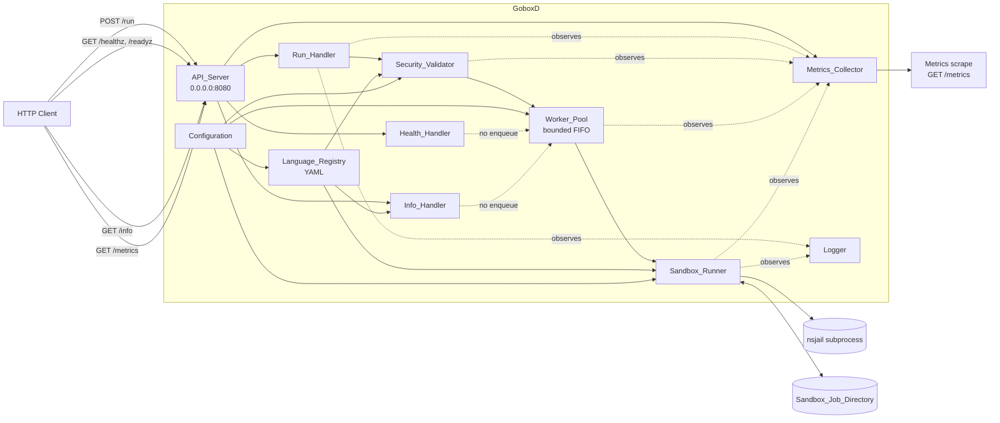
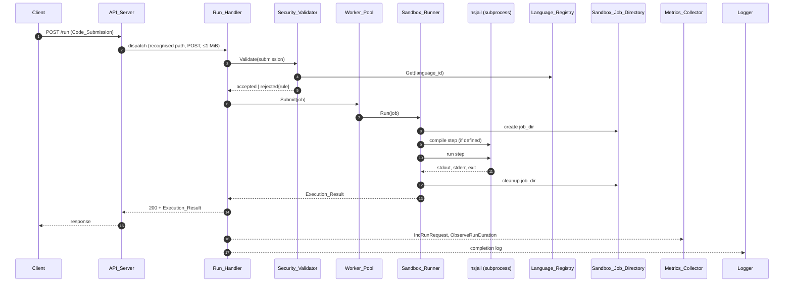

# GoboxD Architecture

GoboxD is a Go HTTP service that compiles and executes untrusted code
inside isolated NsJail sandboxes and returns the result. This document
specifies the architecture of GoboxD: the folder structure it occupies,
the packages it is composed of, the data flow that drives `POST /run`,
the request lifecycle, the NsJail invocation model, the configuration
surface, the observability surface, the testing strategy, and the
phased implementation plan.

This document satisfies Architecture Req 1.1 by being the single
Markdown deliverable located at `docs/architecture.md`. Section
ordering and content satisfy Req 1.2 through Req 1.7. Non-goals
satisfy Req 2.1 through Req 2.5.

---

## §1 Scope

The design described by this document is limited to the following four
top-level paths within the GoboxD repository:

- `cmd/goboxd/` — binary entry point
- `internal/` — private application packages
- `docs/` — design documentation (this file is the only artefact added
  here by the architecture spec)
- `tests/` — integration tests and structural CI gates

Any path outside `cmd/goboxd/`, `internal/`, `docs/`, and `tests/` is
out of scope for this design. The architecture document does not
specify the contents of repository-root files such as the build
manifest, the container image build recipe, or the orchestration
compose file (REQ-1.7).

---

## §2 Non-Goals

The following items are explicitly out of scope for this design and
SHALL NOT be created, modified, renamed, or deleted by any work
performed under this architecture (REQ-2.1):

- `Dockerfile`
- `docker-compose.yml`
- `Makefile`

The following infrastructure capabilities are pre-existing prerequisites
supplied by the host environment and SHALL NOT be implemented,
configured, or altered by this architecture (REQ-2.2):

a. container image build
b. container runtime
c. NsJail binary availability on the runtime path
d. network port exposure

This document is documentation only. No files with the `.go` extension
SHALL be created, modified, or deleted as part of producing this
document; the deliverable consists solely of design documentation
(REQ-2.3). Each component named under §6 is described using exactly
the three labelled subsections "Responsibilities", "Interfaces", and
"Interactions"; this document contains no Go source code, no Go
package declarations, no Go type or struct definitions, and no Go
function bodies (REQ-2.4).

If this document is missing the Non-Goals section, omits any of the
three filenames above, omits any of the four infrastructure items
above, or contains Go source code as defined by REQ-2.4, the review
process SHALL reject the document with a notice identifying each
violating item (REQ-2.5).

---

## §3 High-Level Overview

GoboxD is a single Go binary serving five HTTP endpoints on
`0.0.0.0:8080` (REQ-3.6, REQ-12.6). It receives JSON Code_Submissions
on `POST /run`, validates them, dispatches accepted submissions to a
bounded Worker_Pool, and drives a per-job Sandbox_Runner that invokes
nsjail as a child process. Side-channel components (Metrics_Collector,
Logger) observe the request without altering its result.



Solid arrows are request-driven control or data flow. Dotted arrows
are pure side effects (metrics emission, logging) that do not modify
the request, response, or sandbox state (REQ-17.6, REQ-12.5,
REQ-14.6).

---

## §4 Folder Structure

GoboxD occupies the following layout. Each folder's purpose appears
inline (REQ-15.1, REQ-15.2, REQ-15.3, REQ-15.4, REQ-15.5).

```text
.
├── cmd/
│   └── goboxd/                 Binary entry point. Wires Configuration,
│                               Logger, Language_Registry, Worker_Pool,
│                               Sandbox_Runner, Metrics_Collector and
│                               API_Server, then runs until shutdown.
├── internal/
│   ├── api/                    API_Server: routing, method/body limits,
│   │                           request decoding/encoding helpers.
│   ├── api/handlers/           Run_Handler, Health_Handler, Info_Handler.
│   ├── config/                 Configuration loader, env+YAML precedence,
│   │                           range validation, startup snapshot.
│   ├── log/                    Logger: structured JSON, UUIDv4 ids,
│   │                           ISO 8601 UTC ms timestamps, redaction.
│   ├── metrics/                Metrics_Collector: counters, gauge,
│   │                           histogram, Prometheus exposition.
│   ├── registry/               Language_Registry: YAML load, validation,
│   │                           Get/List, immutable snapshot.
│   ├── runner/                 Sandbox_Runner: NsJail argv builder,
│   │                           child process orchestration, status
│   │                           classification, cleanup, orphan reaper.
│   ├── security/               Security_Validator: rule catalog,
│   │                           filename and placeholder safety.
│   ├── version/                Build-time service name and version
│   │                           constants used by Info_Handler.
│   └── worker/                 Worker_Pool: bounded FIFO queue,
│                               drain semantics, capacity rejection.
├── docs/
│   ├── architecture.md         This document.
│   └── ai/                     AI-assisted development records
│                               (prompts, ADRs, plan evolution,
│                               patterns, issues, postmortem).
└── tests/
    ├── integration/            End-to-end tests selected by the
    │                           `integration` build tag; depend on
    │                           NsJail and Linux namespaces.
    └── structure_test.go       Static dependency-graph check
                                (no build tag; runs under `make test`).
```

### Test classification rule (REQ-15.5, REQ-20.3)

Exactly one mechanism distinguishes unit tests from integration tests:

- **Unit tests** live alongside their package under `internal/<pkg>/`
  in files named `*_test.go` and carry no Go build tag (REQ-20.1).
- **Property tests** live alongside their package under
  `internal/<pkg>/` in files named `*_property_test.go` and carry no
  Go build tag.
- **Integration tests** live under `tests/integration/` in files
  named `*_test.go` and carry the `//go:build integration` build tag
  (REQ-20.2, REQ-20.3). The repository's `integration` make target
  invokes `go test -tags=integration ./tests/...`, so the build tag
  is the selector.

This rule is non-overlapping. A file under `internal/` carrying the
`integration` build tag is forbidden by this design, and a file
under `tests/integration/` without the tag is treated as malformed.

---

## §5 Package Design

For every package under `internal/`, this section states the
responsibility (REQ-16.1), the exported identifiers (REQ-16.2,
REQ-16.3), the imported `internal/` packages (REQ-16.4), and the
test coverage classification (REQ-16.7). The dependency graph
between packages is presented at the end of this section as an
adjacency table; that table is acyclic (REQ-16.5).

### `internal/version`

**Responsibility.** Exposes compile-time `Version` and `ServiceName`
constants used by `Info_Handler`. Inputs: link-time `-ldflags`
overrides. Output: read-only string constants. Owned concern: build
identification.

**Exported identifiers.** `Version` (string, default `"dev"`),
`ServiceName` (string, default `"goboxd"`).

**Imports.** No internal dependencies.

**Test classification.** Not covered by automated tests (compile-time
constants only).

### `internal/log`

**Responsibility.** Structured JSON logger. Inputs: structured event
fields. Outputs: JSON log entries with UUIDv4 `request_id` and ISO
8601 UTC ms `ts`. Owned concern: redaction of `Code_Submission`
payload bytes from every emitted entry at INFO level and above
(REQ-14.4, REQ-14.5).

**Exported identifiers.** `New(level, w)` factory; per-request
logger derivation; UUIDv4 helper; redaction filter applied to all
emissions.

**Imports.** `internal/metrics` (only for the dropped-log counter
when emission fails — REQ-14.6).

**Test classification.** Unit tests under `internal/log/`.

### `internal/config`

**Responsibility.** Loads, validates, and exposes immutable runtime
configuration. Inputs: environment variables, optional YAML config
file path. Output: typed snapshot consumed once by every dependent
package. Owned concern: env > YAML > default precedence, range
validation, startup-time fail-fast on missing or out-of-range keys
(REQ-13.1, REQ-13.2, REQ-13.6).

**Exported identifiers.** `Load(env, yamlPath)` returning the
snapshot or a startup error; typed accessors for every key listed
in §15.

**Imports.** No internal dependencies.

**Test classification.** Unit tests + property tests under
`internal/config/`.

### `internal/metrics`

**Responsibility.** Records counters, gauges, and a histogram per the
catalog in §14, and exposes them in Prometheus text format on
`GET /metrics`. Inputs: emit calls from `Run_Handler`, `Worker_Pool`,
`Security_Validator`, `Sandbox_Runner`, `Logger`. Output: HTTP
exposition. Owned concern: emission failure never alters the
originating request (REQ-12.5).

**Exported identifiers.** `Collector` struct with one method per
metric family (`IncRunRequest`, `ObserveRunDuration`,
`SetQueueDepth`, `IncSecurityRejection`, `IncSandboxCleanupFailure`,
`IncWorkspaceIsolationViolation`, `IncStartupPrereqFailure`,
`IncOrphanWorkspaceReaped`, `IncUnsafeFilename`,
`IncUnknownPlaceholder`, `IncDroppedLog`, `IncDroppedMetric`);
`Handler()` returning the exposition handler.

**Imports.** No internal dependencies.

**Test classification.** Unit tests under `internal/metrics/`.

### `internal/registry`

**Responsibility.** Loads `Language_Definition` entries from a YAML
file at startup; exposes them by case-sensitive exact identifier
match; rejects malformed, duplicated, or missing-field entries with
a non-zero process exit and a structured log (REQ-7.3, REQ-7.4,
REQ-7.7); applies basename validation and placeholder allowlist
checks at load time (REQ-21.2, REQ-22.4).

**Exported identifiers.** `Load(path, log)` returning the registry
or a startup error; `Get(id)` returning the matching definition or a
distinguishable not-found result; `List()` returning all loaded
identifiers.

**Imports.** `internal/config`, `internal/log`, `internal/security`.

**Test classification.** Unit tests + property tests under
`internal/registry/`.

### `internal/security`

**Responsibility.** Validates `Code_Submission` payloads against the
rule catalog in §13 (REQ-11.1 through REQ-11.7); validates
`Language_Definition` filenames as safe basenames (REQ-21);
maintains the closed placeholder allowlist
`{SOURCE_FILENAME, BINARY_FILENAME, STDIN_FILE}` (REQ-22.3).

**Exported identifiers.** `Validate(submission, cfg, registry)`
returning accept or structured rejection;
`ValidateBasename(name)`; `IsAllowedPlaceholder(name)`;
`AllowedPlaceholders` constant slice; typed errors
`ErrUnsafeFilename`, `ErrUnknownPlaceholder`.

**Imports.** `internal/config`, `internal/registry`,
`internal/log`, `internal/metrics`.

**Test classification.** Unit tests + property tests under
`internal/security/`.

### `internal/runner`

**Responsibility.** Builds the NsJail invocation, executes compile
and run steps as child subprocesses, captures stdout/stderr with
streaming bounds, classifies outcomes into `Execution_Result`
status, and removes the per-request `Sandbox_Job_Directory` on every
termination mode (REQ-10, REQ-23, REQ-24). Owns the orphan reaper
goroutine (REQ-26.8).

**Exported identifiers.** `BuildArgv(in)` (pure argv builder);
`Classify(in)` (pure status classifier); `Capture(r, limit)`
(memory-bounded discarder); `AllocateWorkspace(root, requestID)`;
`StartReaper(ctx, root, ttl)`; `New(cfg)` constructing a
`*SandboxRunner`; `Run(ctx, job, stdin)` the orchestrator;
`CleanupOnly(ws)` for deferred cleanup paths; `ExecLauncher`
interface for test injection; observer interfaces
`SandboxObserver`, `WorkspaceObserver`, `ReaperObserver` (see §6).

**Imports.** `internal/config`, `internal/registry`,
`internal/log`, `internal/metrics`, `internal/security`.

**Test classification.** Unit tests + property tests under
`internal/runner/`; integration coverage under `tests/integration/`.

### `internal/worker`

**Responsibility.** Bounds concurrent jobs to the configured
maximum and queues additional submissions in a FIFO of bounded
length; rejects on capacity exhaustion (REQ-9.3); drains on
shutdown (REQ-9.7, REQ-9.8, REQ-9.9).

**Exported identifiers.** `Pool` struct; `Submit(ctx, job)`
returning accepted (with a result channel) or
`ErrCapacityExhausted`; `Drain(timeout)`; `QueueDepth()`;
`Observer` interface for queue-depth and rejection notifications.

**Imports.** `internal/config`, `internal/log`, `internal/metrics`,
`internal/runner`.

**Test classification.** Unit tests + property tests under
`internal/worker/`.

### `internal/api/handlers`

**Responsibility.** Implements `Run_Handler`, `Health_Handler`,
`Info_Handler`. Decodes JSON bodies, applies size caps, calls into
`internal/security` and `internal/worker`, formats responses,
emits per-request log entries (REQ-14.1, REQ-14.7) and metric
increments (REQ-12.1, REQ-12.4).

**Exported identifiers.** Handler factories returning
`http.Handler` values for each endpoint; the `RunDeps` struct that
the orchestrator (`cmd/goboxd`) populates at startup.

**Imports.** `internal/config`, `internal/log`, `internal/metrics`,
`internal/registry`, `internal/security`, `internal/version`,
`internal/worker`.

**Test classification.** Unit tests under
`internal/api/handlers/`.

### `internal/api`

**Responsibility.** Owns the HTTP listener bound to `0.0.0.0:8080`
(REQ-3.6). Routes by exact path; enforces method allow-lists and
the 1 MiB body cap on `POST /run` (REQ-3.7, REQ-3.8, REQ-3.11);
returns HTTP 404 for unrecognised paths and HTTP 405 for
unsupported methods on recognised paths (REQ-3.9); coordinates
graceful shutdown (REQ-5.8, REQ-9.7).

**Exported identifiers.** `Server` struct;
`Start(addr)`/`Shutdown(reason)`; `Router` factory.

**Imports.** `internal/api/handlers`, `internal/log`,
`internal/metrics`.

**Test classification.** Unit tests under `internal/api/`.

### Dependency graph (REQ-16.4, REQ-16.5)

The acyclic adjacency table below names every directed edge. A
package not listed has no internal dependencies.

| Package | Imports |
| --- | --- |
| `internal/version` | (none) |
| `internal/config` | (none) |
| `internal/metrics` | (none) |
| `internal/log` | `internal/metrics` |
| `internal/registry` | `internal/config`, `internal/log`, `internal/security` |
| `internal/security` | `internal/config`, `internal/log`, `internal/metrics`, `internal/registry` |
| `internal/runner` | `internal/config`, `internal/log`, `internal/metrics`, `internal/registry`, `internal/security` |
| `internal/worker` | `internal/config`, `internal/log`, `internal/metrics`, `internal/runner` |
| `internal/api/handlers` | `internal/config`, `internal/log`, `internal/metrics`, `internal/registry`, `internal/security`, `internal/version`, `internal/worker` |
| `internal/api` | `internal/api/handlers`, `internal/log`, `internal/metrics` |

The graph contains zero cycles. The static check at
`tests/structure_test.go` parses `go list` output and fails if any
edge appears that is not in this table or if any cycle is detected
(REQ-16.6).

---

## §6 Component Catalog

Every component below is described using exactly three labelled
subsections — Responsibilities, Interfaces, Interactions — per
REQ-2.4. No Go source code appears.

### API_Server

**Responsibilities.** Owns the HTTP listener bound to `0.0.0.0:8080`
(REQ-3.6). Routes by exact path. Enforces method allow-lists and
the 1 MiB body cap on `POST /run` (REQ-3.7, REQ-3.8, REQ-3.11).
Returns HTTP 404 for unrecognised paths and HTTP 405 for
unsupported methods on recognised paths (REQ-3.7, REQ-3.8,
REQ-3.9). Initiates graceful shutdown on OS termination signal and
signals `Worker_Pool` to drain (REQ-5.8, REQ-9.7, REQ-9.8,
REQ-9.9). Hosts the metrics scrape endpoint (REQ-12.6).

**Interfaces.**
- `Start(addr)` → listening or startup error.
- `Route(method, path)` → handler, 404, or 405 with `Allow` header.
- `Shutdown(reason)` → drained or drain-timed-out.

**Interactions.** Reads `API_BIND_ADDR` and the body size cap from
`Configuration`. Delegates to `Run_Handler`, `Health_Handler`,
`Info_Handler`. Notifies `Health_Handler` of shutdown state so
`/readyz` flips to 503 while `/healthz` continues 200 until the
listener closes (REQ-5.8). Failures from handlers map to HTTP 500
only when unexpected (REQ-3.9).

### Run_Handler

**Responsibilities.** Executes the `POST /run` lifecycle (REQ-4,
REQ-18). Decodes the JSON `Code_Submission`, calls
`Security_Validator`, enqueues to `Worker_Pool`, awaits
`Execution_Result`, emits the JSON response. Owns request-scoped
state: request UUIDv4, `Sandbox_Job_Directory` path, deadline.
Guarantees `Sandbox_Job_Directory` removal regardless of outcome
(REQ-4.9, REQ-24.4).

**Interfaces.**
- `Handle(http_request)` → 200 with `Execution_Result` or a
  documented non-2xx error.
- `EnsureCleanup(job_dir)` invoked from a deferred path; cleanup
  failure is logged and metricised but does not change the response
  code (REQ-4.10).

**Interactions.** Reads max source size, max stdin size, default
per-language ceilings, and max body size from `Configuration`.
Calls `Security_Validator.Validate(submission)` (REQ-11.6,
REQ-11.7). On accept, calls `Worker_Pool.Submit(job)`; on capacity
rejection returns 429 (REQ-4.5, REQ-9.3). Receives
`Execution_Result` from the `Worker_Pool` job context. Records
request count, status, duration to `Metrics_Collector` (REQ-12.1,
REQ-12.2). Writes one structured log entry on completion
(REQ-14.1, REQ-14.7).

### Health_Handler

**Responsibilities.** Serves `GET /healthz` (liveness) within
100 ms and `GET /readyz` (readiness) within 200 ms under nominal
load (REQ-5.1, REQ-5.2). Never enqueues to `Worker_Pool`, never
spawns NsJail, never holds locks shared with `Run_Handler`
(REQ-5.6). Method-not-GET returns 405 (REQ-5.7). Returns 503 from
`/readyz` while shutdown is in progress; continues 200 from
`/healthz` until the listener closes (REQ-5.8).

**Interfaces.**
- `Live()` → 200 while the listener is up.
- `Ready()` → 200 with a ready indicator, or 503 with a body
  enumerating every failed condition (REQ-5.5).

**Interactions.** Reads boolean readiness signals from
`Language_Registry`, `Worker_Pool`, `Sandbox_Runner` (NsJail
binary present and executable). Reads shutdown flag from
`API_Server`. Emits no per-request metrics, logs nothing per
request.

### Info_Handler

**Responsibilities.** Serves `GET /info` within 500 ms (REQ-6.1).
Returns service name, build version, registered language
identifiers (possibly empty), and configured `Worker_Pool` size.
Never includes secrets, file system paths, or Code_Submission-
derived values (REQ-6.2). Never enqueues (REQ-6.3). Method-not-GET
returns 405 (REQ-6.4).

**Interfaces.**
- `Info()` → 200 with `{service_name, version, languages,
  worker_pool_size}`.

**Interactions.** Reads service name and version from
`internal/version`; language identifier list from
`Language_Registry`; pool size from `Worker_Pool` configuration
snapshot.

### Language_Registry

**Responsibilities.** Loads `Language_Definition` entries from a
YAML file at startup (REQ-7.1). Validates required fields per
definition; rejects duplicate identifiers (REQ-7.7); treats
absence of a compile command as "skip compile step" (REQ-8.3).
Validates basenames and placeholder allowlist at load time
(REQ-21.2, REQ-22.4). Immutable after load.

**Interfaces.**
- `Load(path)` → ready or startup error; on any error, GoboxD exits
  non-zero with a log entry naming path and reason (REQ-7.3,
  REQ-7.4, REQ-13.7).
- `Get(language_id)` → `Language_Definition` or distinguishable
  not-found result; never mutates state (REQ-7.5).
- `List()` → identifier list used by `Info_Handler` and readiness.

**Interactions.** Read at startup from the path in
`Configuration`. Read at request time by `Security_Validator`
(membership check) and `Sandbox_Runner` (compile/run command
lookup, default `Resource_Limits`). Read at info time by
`Info_Handler`.

### Worker_Pool

**Responsibilities.** Bounds concurrent jobs to the configured
maximum (1..1024) and queues additional submissions in a FIFO of
bounded length (0..10000) (REQ-9.1, REQ-9.2, REQ-9.4). Rejects
on capacity exhaustion immediately, even if a worker becomes idle
moments later (REQ-9.3). Performs graceful drain on shutdown for
the configured drain timeout (0..3600 s) (REQ-9.7, REQ-9.8,
REQ-9.9). Validates configuration at startup; invalid values
cause startup failure (REQ-9.6, REQ-13.6).

**Interfaces.**
- `Submit(job)` → accepted with a result channel, or rejected with
  capacity-exhausted.
- `Drain(timeout)` → `(drained, cancelled)` counts; semantics
  depend on timeout per REQ-9.7, REQ-9.8, REQ-9.9.
- `QueueDepth()` → non-negative integer read by
  `Metrics_Collector`.

**Interactions.** Reads `WORKER_POOL_SIZE`, `WORKER_POOL_QUEUE_LEN`,
`WORKER_POOL_DRAIN_TIMEOUT_S` from `Configuration`. Pulls jobs in
FIFO order; assigns to idle workers; each worker calls
`Sandbox_Runner.Run(job)`. On enqueue and dequeue, updates the
queue-depth gauge through `Metrics_Collector` (REQ-12.3).

### Sandbox_Runner

**Responsibilities.** For each accepted job, creates the
`Sandbox_Job_Directory`, materialises the source file, and
invokes nsjail as a child subprocess for the compile step (when
the language defines one) and the run step (REQ-10.1, REQ-10.2).
Enforces `Resource_Limits` via nsjail flags (REQ-10.3).
Bind-mounts the job directory read-write and toolchain paths
read-only (REQ-10.4). Captures stdout/stderr up to 1 MiB each,
feeds stdin up to 1 MiB, marks truncation in the result
(REQ-10.5, REQ-23). Classifies the outcome to a single
`Execution_Result` status using the deterministic mapping in
REQ-10.6. Returns `INTERNAL_ERROR` if nsjail cannot be located,
fails to launch within 5 s, or exits without a parseable outcome,
with no partial stdout or stderr returned (REQ-10.7). Always
removes `Sandbox_Job_Directory` before returning, and reports
cleanup failure separately (REQ-4.9, REQ-4.10, REQ-24.4).

**Interfaces.**
- `Run(job)` → `Execution_Result`. Full compile-then-run sequence;
  `job` carries the language definition, source, stdin, effective
  `Resource_Limits`, and request id.
- `CleanupOnly(job_dir)` invoked from deferred paths on panic,
  timeout, or shutdown.

**Interactions.** Reads compile and run commands and default
`Resource_Limits` from `Language_Registry`. Reads the nsjail
binary path and bind-mount allow-list from `Configuration`.
Spawns nsjail as a child process. Writes/reads
`Sandbox_Job_Directory` on the host filesystem. Records sandbox
outcome counters via `Metrics_Collector`. Emits structured logs at
completion and on failure (REQ-14.1, REQ-14.5).

**Workspace isolation.** For every accepted job, `Sandbox_Runner`
creates a per-request directory at
`<SANDBOX_ROOT_DIR>/job-<UUIDv4>`, where the UUIDv4 is the
request's `request_id` (REQ-24.1, REQ-24.2). The UUIDv4 is
generated from a cryptographically secure source by `Run_Handler`
and provides at least 128 bits of entropy, so no two requests —
concurrent or sequential — can share a workspace path or observe
each other's contents (REQ-24.3).

The runner records the workspace path it created in the `Job`
context at creation time. **Ownership invariant:** every
operation that writes to or removes a `Sandbox_Job_Directory`
first compares the target path to the path recorded in the `Job`
context for the current request. If the paths do not match,
`Sandbox_Runner` refuses the operation, returns an
`Execution_Result` with `status = INTERNAL_ERROR`, increments
`goboxd_workspace_isolation_violation_total`, and emits an ERROR
log entry with fields `event="workspace_isolation_violation"`,
`request_id`, `expected_path`, `received_path` (REQ-24.5).

**Cleanup paths.** Deferred cleanup is owned by `Run_Handler` and
runs on every termination mode of the request lifecycle: success,
compile failure, runtime failure, classified `INTERNAL_ERROR`,
execution timeout, runtime panic, shutdown signal, and request
cancellation (REQ-24.4). Cleanup invokes
`Sandbox_Runner.CleanupOnly(job_dir)`, which itself enforces the
ownership invariant before removing.

**Orphan reaper.** Cleanup failures are recovered by a periodic
orphan reaper goroutine. It uses `SANDBOX_ORPHAN_TTL_S` to decide
which `<SANDBOX_ROOT_DIR>/job-*` entries are stale and removes
them; each successful removal increments
`goboxd_orphan_workspace_reaped_total` (REQ-26.8).

### Security_Validator

**Responsibilities.** Validates an incoming `Code_Submission`
against the rule catalog before any sandbox is allocated
(REQ-11.6). Produces an accept-or-reject decision within 50 ms at
the 99th percentile (REQ-11.7). Rejection reasons are structured:
rule name, offending field, requested value, configured limit
where applicable (REQ-11.1 through REQ-11.5). Decision is
deterministic for a given `(submission, configuration)` pair.

**Interfaces.**
- `Validate(submission)` → accepted, or rejected with
  `{rule_name, detail}` where `rule_name` ∈
  `{source_size_exceeded, stdin_size_exceeded,
    language_not_registered, resource_limit_exceeded,
    malformed_submission}`.

**Interactions.** Reads thresholds from `Configuration`. Reads
language membership from `Language_Registry`. On rejection,
records a counter increment to `Metrics_Collector` partitioned by
`rule_name` (REQ-12.4); `Run_Handler` then emits a structured
rejection log entry (REQ-14.7). Never enqueues, never spawns
sandbox.

### Metrics_Collector

**Responsibilities.** Records counters, gauges, and a histogram per
the catalog in §14 (REQ-12.1 through REQ-12.4). Exposes Prometheus
text format at `GET /metrics` with maximum staleness ≤1 s between
metric update and exposition (REQ-12.6). Failure to record a
metric never alters the originating request's `Execution_Result`;
it increments an internal `goboxd_dropped_metrics_total` and
emits a structured WARN log line (REQ-12.5, REQ-14.6).

**Interfaces.**
- Emit calls (best-effort, no return value visible to callers):
  `IncRunRequest(language, status)`,
  `ObserveRunDuration(seconds)`, `SetQueueDepth(n)`,
  `IncSecurityRejection(rule_name)`,
  `IncSandboxCleanupFailure()`,
  `IncWorkspaceIsolationViolation()`,
  `IncStartupPrereqFailure(prereq)`,
  `IncOrphanWorkspaceReaped()`,
  `IncUnsafeFilename(source)`,
  `IncUnknownPlaceholder(source)`,
  `IncDroppedMetric(reason)`, `IncDroppedLog(reason)`.
- `Handler()` → HTTP handler producing the Prometheus text
  exposition.

**Interactions.** Hooked from `Run_Handler` (request count and
duration), `Worker_Pool` (queue depth), `Security_Validator`
(rejections), `Sandbox_Runner` (sandbox outcomes by status),
`Logger` (dropped log counter). Read via `API_Server` route for
`GET /metrics`.

### Configuration

**Responsibilities.** Loads, validates, and exposes immutable
runtime configuration. Resolves env > YAML > default precedence
(REQ-13.2). Rejects missing, out-of-range, or unparseable values
at startup with a non-zero exit and a log entry naming the
offending key (REQ-13.6).

**Interfaces.**
- `Load(env, yaml_path?)` → snapshot or startup error.
- `Get(key)` → typed value; consumers receive a snapshot rather
  than re-reading at request time.

**Interactions.** Read once at startup by `API_Server`,
`Language_Registry`, `Worker_Pool`, `Sandbox_Runner`,
`Security_Validator`, `Metrics_Collector`, `Logger`. After
startup, configuration is constant for the lifetime of the
process.

### Logger

**Responsibilities.** Emits structured (JSON) log entries with
UUIDv4 request identifiers, ISO 8601 UTC timestamps with
millisecond precision, and levels DEBUG, INFO, WARN, ERROR
(REQ-14.1, REQ-14.7). Redacts `Code_Submission` source code,
stdin, stdout, and stderr from every entry at INFO and above;
permits sandbox argument lists at DEBUG but never the user
payload (REQ-14.4, REQ-14.5). Failure to emit increments a
dropped-log counter via `Metrics_Collector` and never alters the
request's result (REQ-14.6).

**Interfaces.**
- `Info(event, fields)`, `Warn(event, fields)`,
  `Error(event, fields)`, `Debug(event, fields)`.
- `WithRequest(request_id)` → derived logger that auto-injects
  `request_id`.

**Interactions.** Used by `API_Server` (startup, shutdown),
`Run_Handler` (per-request completion and rejection),
`Sandbox_Runner` (per-step completion, NsJail failures),
`Worker_Pool` (drain summary), `Configuration` (startup
validation outcomes).

---

## §7 HTTP API Reference

This section specifies, for each endpoint, the request shape, the
response shape, and the HTTP status codes for the success path and
each documented failure mode (REQ-3.5, REQ-6).

### `POST /run`

**Request.** `Content-Type: application/json` (REQ-3.10). Body
≤ 1 MiB (REQ-3.11). Body shape: `Code_Submission`:

| Field | Type | Required | Range / validation |
| --- | --- | --- | --- |
| `language` | string | yes | Exact match in `Language_Registry` (REQ-11.3) |
| `source` | string (UTF-8) | yes | Non-empty; size ≤ `MAX_SOURCE_SIZE_BYTES` (default 1 MiB; range 1..10,485,760) (REQ-11.1, REQ-13.5) |
| `stdin` | string (UTF-8) | no | Size ≤ `MAX_STDIN_SIZE_BYTES` (default 1 MiB; range 0..10,485,760) (REQ-11.2, REQ-13.5) |
| `resource_limits` | object | no | Per-field overrides; each ≤ per-language ceiling (REQ-11.4) |
| `resource_limits.wall_time_s` | int | no | 1..60 (REQ-10.3) |
| `resource_limits.cpu_time_s` | int | no | 1..60 (REQ-10.3) |
| `resource_limits.memory_mb` | int | no | 16..1024 (REQ-10.3) |
| `resource_limits.process_count` | int | no | 1..64 (REQ-10.3) |
| `resource_limits.output_size_mb` | int | no | 1..64 (REQ-10.3) |

**Response (success — HTTP 200).** `Content-Type:
application/json`. Body shape: `Execution_Result`:

| Field | Type | Notes |
| --- | --- | --- |
| `status` | enum string | `OK` \| `COMPILATION_ERROR` \| `RUNTIME_ERROR` \| `TIME_LIMIT_EXCEEDED` \| `MEMORY_LIMIT_EXCEEDED` \| `INTERNAL_ERROR` (REQ-4.6 through REQ-4.8, REQ-10.6) |
| `exit_code` | int or sentinel | Process exit code; sentinel `-1` when terminated by signal (REQ-4.2) |
| `stdout` | string | Captured up to `STDOUT_CAPTURE_LIMIT_BYTES` (default 1 MiB) (REQ-4.2, REQ-10.5) |
| `stderr` | string | Captured up to `STDERR_CAPTURE_LIMIT_BYTES` (default 1 MiB) (REQ-4.2, REQ-10.5) |
| `stdout_truncated` | bool | True when capture limit reached (REQ-10.5) |
| `stderr_truncated` | bool | True when capture limit reached (REQ-10.5) |
| `duration_ms` | int | Wall-clock duration of the run step, 0..2,147,483,647 (REQ-4.2, REQ-14.1) |
| `request_id` | UUIDv4 string | Echoed for correlation (REQ-14.1) |

**Failure modes.**
- 400 — body not JSON, body fails schema (REQ-3.10), body > 1 MiB
  (REQ-3.11), language not in registry (REQ-4.3),
  Security_Validator rejection (REQ-4.4), oversize source or
  malformed submission (REQ-4.11).
- 405 — non-POST method (REQ-3.8).
- 429 — Worker_Pool capacity exhausted (REQ-4.5, REQ-9.3).
- 500 — unexpected internal failure (REQ-3.9).

### `GET /healthz`

**Request.** GET, no body.

**Response (success — HTTP 200).** `Content-Type:
application/json`. Body: `{ "status": "<healthy indicator>" }`
(REQ-5.1).

**Failure modes.**
- 405 — non-GET method (REQ-5.7).

`/healthz` continues to return 200 until the listener closes,
including during shutdown (REQ-5.8).

### `GET /readyz`

**Request.** GET, no body.

**Response (success — HTTP 200).** `Content-Type:
application/json`. Body: `{ "ready": <ready indicator> }`
(REQ-5.2).

**Failure modes (HTTP 503).** Body lists every failed condition
(REQ-5.5):
- `Language_Registry` not loaded or reporting load errors
  (REQ-5.3).
- `NsJail` binary missing or not executable at configured path
  (REQ-5.4).
- `Worker_Pool` not at minimum worker count.
- Shutdown in progress (REQ-5.8).

405 — non-GET method (REQ-5.7).

### `GET /info`

**Request.** GET, no body.

**Response (success — HTTP 200).** `Content-Type:
application/json`. Body fields (REQ-6.1, REQ-6.2):
- `service_name` — non-empty string from `internal/version`.
- `version` — non-empty string from `internal/version`.
- `languages` — array of registered language identifiers; may be
  empty.
- `worker_pool_size` — non-negative integer.

No secret, file system path, or `Code_Submission`-derived value
is included (REQ-6.2).

**Failure modes.**
- 405 — non-GET method (REQ-6.4).

### `GET /metrics`

**Request.** GET, no body.

**Response (success — HTTP 200).** `Content-Type:
text/plain; version=0.0.4` (Prometheus text format). Body: every
metric in §14 with current values (REQ-12.6).

### Path/method partition

Any path other than `/run`, `/healthz`, `/readyz`, `/info`,
`/metrics` returns HTTP 404 (REQ-3.7). HTTP 404 is reserved for
unrecognised paths; HTTP 400 is used for recognised paths whose
body fails validation; HTTP 405 is used for unsupported methods on
recognised paths; HTTP 500 is used for unexpected internal
failures on recognised paths (REQ-3.9).

---

## §8 Data Flow for `POST /run`

This section presents the data flow as a numbered narrative tied to
a sequence diagram (REQ-17.1). Each step lists input, output,
persistent or transient state, and the failure modes that
terminate the flow at that step with their HTTP status codes
(REQ-17.3, REQ-17.4). Side-effect components (`Metrics_Collector`,
`Logger`) are shown but never alter recorded inputs, outputs, or
state (REQ-17.6). Component names match those defined elsewhere
in this document (REQ-17.2).



**Step list.** Each step states `input`, `output`, `state`,
`failure modes`.

1. **Receive request (API_Server).**
   `input`: TCP connection from client. `output`: parsed `(method,
   path, headers, body)`. `state`: none.
   `failure modes`: unrecognised path → 404 (REQ-3.7); unsupported
   method on recognised path → 405 with `Allow` header (REQ-3.8);
   non-`application/json` Content-Type → 400 (REQ-3.10); body
   > 1 MiB → 400 (REQ-3.11). Flow terminates at this step on each.

2. **Decode body (Run_Handler).**
   `input`: byte stream. `output`: typed `Code_Submission` value.
   `state`: none.
   `failure modes`: malformed JSON or schema mismatch → 400
   (REQ-3.10, REQ-4.11). Flow terminates at this step.

3. **Validate submission (Security_Validator).**
   `input`: `Code_Submission` + `Configuration` thresholds +
   `Language_Registry` membership. `output`: accepted, or
   `rejected{rule_name, detail}`. `state`: none.
   `failure modes`: `language_not_registered` → 400 (REQ-4.3,
   REQ-11.3); `source_size_exceeded` → 400 (REQ-11.1);
   `stdin_size_exceeded` → 400 (REQ-11.2);
   `resource_limit_exceeded` → 400 (REQ-11.4);
   `malformed_submission` → 400 (REQ-11.5). Flow terminates.
   Side effect: `Metrics_Collector.IncSecurityRejection(rule)`;
   `Logger` emits one rejection entry (REQ-12.4, REQ-14.7).

4. **Enqueue (Worker_Pool).**
   `input`: validated job. `output`: accepted with result channel,
   or `rejected{capacity_exhausted}`. `state`: queue depth gauge
   updated.
   `failure modes`: capacity exhaustion → 429 (REQ-4.5, REQ-9.3).
   Flow terminates. Side effect: `Metrics_Collector.SetQueueDepth`.

5. **Allocate workspace and materialise files (Sandbox_Runner).**
   `input`: job + `SANDBOX_ROOT_DIR`. `output`: `job_dir` path.
   `state`: filesystem directory created at
   `<SANDBOX_ROOT_DIR>/job-<UUIDv4>` (REQ-24.1).
   `failure modes`: filesystem failure → `Execution_Result.status =
   INTERNAL_ERROR` returned to step 8 with cleanup deferred
   (REQ-24.4).

6. **Compile step (Sandbox_Runner; conditional, REQ-18.3).**
   `input`: `Language_Definition.compile.command` + args + limits +
   nsjail flags. `output`: compiled artefact in `job_dir` or
   non-zero exit. `state`: `job_dir` contents updated.
   `failure modes`: non-zero compile exit → `status =
   COMPILATION_ERROR` with truncated stderr (REQ-4.8); compile-step
   time limit → `COMPILATION_ERROR` (REQ-4.8); nsjail invocation
   failure → `INTERNAL_ERROR` with no partial stdout/stderr
   (REQ-10.7). Flow proceeds to step 8 in failure cases (run step
   skipped).

7. **Run step (Sandbox_Runner).**
   `input`: `Language_Definition.run.command` + args + effective
   `Resource_Limits` + nsjail flags + stdin (≤ 1 MiB). `output`:
   captured stdout/stderr (≤ 1 MiB each), exit code, signal
   indicator. `state`: streaming captures bounded to limits
   (REQ-23).
   `failure modes`: wall-time limit → `TIME_LIMIT_EXCEEDED`
   (REQ-4.6); memory limit (when nsjail attributes it) →
   `MEMORY_LIMIT_EXCEEDED`, otherwise `RUNTIME_ERROR` (REQ-4.7);
   non-zero exit on run step → `RUNTIME_ERROR` (REQ-10.6); nsjail
   invocation failure → `INTERNAL_ERROR` (REQ-10.7).

8. **Aggregate result + cleanup (Sandbox_Runner + Run_Handler).**
   `input`: classified status + captured streams + duration.
   `output`: `Execution_Result`. `state`: `job_dir` removed by
   deferred cleanup regardless of outcome (REQ-4.9, REQ-24.4).
   `failure modes`: cleanup failure does not alter the response
   (REQ-4.10); side effect:
   `Metrics_Collector.IncSandboxCleanupFailure`,
   `Logger.Error(event="sandbox_cleanup_failed")`.

9. **Emit response + observability (Run_Handler).**
   `input`: `Execution_Result`. `output`: HTTP 200 with JSON body.
   `state`: none.
   `failure modes`: no failure mode terminates the flow at this
   step.
   Side effects (REQ-17.6):
   `Metrics_Collector.IncRunRequest(language, status)`;
   `ObserveRunDuration`; `Logger.Info(event="run_completed", ...)`
   (REQ-12.1, REQ-12.2, REQ-14.1).

### Worked error path

`POST /run` with `language: "rust"` not in registry: step 1
succeeds; step 2 decodes; step 3 returns
`rejected{language_not_registered}`. Flow terminates at step 3
with HTTP 400 carrying the rejection reason. Steps 4–9 do not
execute. `Metrics_Collector.IncSecurityRejection
("language_not_registered")` is invoked as a side effect.
`Logger` emits one rejection log entry with `request_id` and ISO
8601 UTC ms timestamp (REQ-14.7).

---

## §9 Request Lifecycle

### `POST /run` lifecycle (REQ-18.1, REQ-18.2)

| # | Step | Component | Mandatory? | Inputs | Outputs |
| --- | --- | --- | --- | --- | --- |
| 1 | Receipt and decode | API_Server, Run_Handler | mandatory | HTTP request | `Code_Submission` |
| 2 | Validate | Security_Validator | mandatory | submission + config + registry | accept or rejection |
| 3 | Enqueue | Worker_Pool | mandatory on accept | job | result channel |
| 4 | Allocate `Sandbox_Job_Directory` | Sandbox_Runner | mandatory on dequeue | `SANDBOX_ROOT_DIR` + UUIDv4 | `job_dir` path |
| 5 | Compile step | Sandbox_Runner | conditional — only when `Language_Definition.compile.command` is non-empty | source file + compile template | compiled artefact or `COMPILATION_ERROR` |
| 6 | Run step | Sandbox_Runner | mandatory | run template + stdin | captured outputs + classified status |
| 7 | Aggregate result | Sandbox_Runner | mandatory | step 5/6 outputs | `Execution_Result` |
| 8 | Cleanup | Run_Handler (deferred) | mandatory | `job_dir` | removed |

### Cleanup guarantees

Across the failure modes listed in REQ-18.5, the cleanup step
(8) is guaranteed to execute. The order is:

- **Execution timeout.** Steps 1–7 (or partial 5–6) run, then
  step 8.
- **Process panic in handler.** A deferred path catches the
  panic, runs step 8 with cleanup observation, then re-raises.
- **Shutdown signal.** The `Worker_Pool.Drain` path either
  completes the lifecycle through step 8 within the configured
  drain timeout, or cancels in-flight jobs and runs step 8
  through `CleanupOnly` against the workspaces those jobs
  allocated.

Observable post-conditions in all three modes: the
`Sandbox_Job_Directory` no longer exists on disk; spawned nsjail
processes have terminated (the PID namespace nsjail owns
collects the descendants on teardown).

### Cleanup failure (REQ-18.6)

If step 8 fails, the resulting state is: the
`Sandbox_Job_Directory` may persist on disk; the response body
already returned to the caller is unchanged (REQ-4.10). The
failure is recorded as
`goboxd_sandbox_cleanup_failures_total++` and an ERROR log entry
with `event="sandbox_cleanup_failed"`, `request_id`, `job_dir`,
`os_error`. Recovery on subsequent requests: the orphan reaper
goroutine removes
`<SANDBOX_ROOT_DIR>/job-*` entries older than
`SANDBOX_ORPHAN_TTL_S` and increments
`goboxd_orphan_workspace_reaped_total` per removal (REQ-26.8).

### Lifecycles for `/healthz`, `/readyz`, `/info` (REQ-18.7)

| Endpoint | Steps | Sandbox / pool / compile / run? |
| --- | --- | --- |
| `GET /healthz` | (1) API_Server route → (2) Health_Handler.Live → (3) write 200 JSON | None executed; never enqueues; no NsJail spawned |
| `GET /readyz` | (1) API_Server route → (2) Health_Handler.Ready (snapshot Language_Registry, Worker_Pool, Sandbox_Runner readiness, shutdown flag) → (3) write 200 or 503 with `failed_components` | None executed |
| `GET /info` | (1) API_Server route → (2) Info_Handler.Info (read version constant + registry list + pool size snapshot) → (3) write 200 JSON | None executed |

---

## §10 Worker_Pool Design

| Aspect | Specification | Requirement |
| --- | --- | --- |
| Concurrency bound | configured maximum (1..1024) | REQ-9.1 |
| Queue type | bounded FIFO, length 0..10000 | REQ-9.2, REQ-9.4 |
| Submit semantics | synchronous accept/reject; no retroactive accept | REQ-9.3 |
| Drain timeout | 0..3600 s; T>0 waits then cancels remainder; T=0 cancels in-flight + discards queued | REQ-9.7, REQ-9.8, REQ-9.9 |
| Configuration validation | invalid values cause startup failure | REQ-9.6, REQ-13.6 |
| Queue depth observability | `goboxd_worker_pool_queue_depth` gauge updated on every enqueue/dequeue | REQ-12.3 |

Capacity-exhausted submissions return HTTP 429 with body
`{ "error": "capacity_exhausted", "queue_max": N, "workers_max": M }`
(REQ-4.5).

---

## §11 Sandbox Runner & NsJail Invocation Template

### Argument template

`Sandbox_Runner` constructs the nsjail invocation as a positional
argv (no shell). The template documents every flag and every
placeholder substituted per request (REQ-10.8).

| Flag | Source | Notes |
| --- | --- | --- |
| `--mode o` | constant | One-shot mode |
| `--user 65534 --group 65534` | constant | nobody:nogroup inside the user namespace |
| `--hostname goboxd-sandbox` | constant | |
| `--cwd /sandbox` | constant | Guest-side working directory |
| `--disable_proc` | constant | /proc is not exposed |
| `--time_limit <wall_time_s>` | `Job.effective_limits` | 1..60 (REQ-10.3) |
| `--rlimit_cpu <cpu_time_s>` | `Job.effective_limits` | 1..60 (REQ-10.3) |
| `--rlimit_as <memory_mb>` | `Job.effective_limits` | 16..1024 (REQ-10.3) |
| `--rlimit_nproc <process_count>` | `Job.effective_limits` | 1..64 (REQ-10.3) |
| `--rlimit_fsize <output_size_mb>` | `Job.effective_limits` | 1..64 (REQ-10.3) |
| `--rlimit_nofile 64`, `--max_cpus 1` | constants | |
| `--bindmount <JOB_DIR>:/sandbox` | per-request | The single rw mount (REQ-10.4) |
| `--bindmount_ro <host>:<guest>` × N | `Configuration.SANDBOX_RO_MOUNTS` | Read-only toolchain paths |
| `--tmpfsmount /tmp` | constant | Writable scratch outside JOB_DIR |
| `--env <NAME>=<VALUE>` × N | closed env allowlist | Never includes Code_Submission fields (REQ-22.2(d)) |
| `--seccomp_string <policy>` | `Configuration.SANDBOX_SECCOMP_POLICY` | Compiled at startup |
| `--log /dev/null` | constant | Application captures child stderr separately |
| `--` | constant | Terminator |
| `<command>` | `Language_Definition.compile.command` or `.run.command` | Trusted template |
| `<args...>` | `Language_Definition.compile.args` or `.run.args` | With placeholders expanded |

### Placeholder substitution

The closed allowlist `{SOURCE_FILENAME, BINARY_FILENAME,
STDIN_FILE}` is the only set of placeholders the substitution
algorithm accepts (REQ-22.3). Each placeholder is replaced with
the validated basename:

- `{{SOURCE_FILENAME}}` → `Language_Definition.source_filename`
- `{{BINARY_FILENAME}}` → `Language_Definition.binary_filename`
- `{{STDIN_FILE}}` → the per-request stdin file basename inside
  `Sandbox_Job_Directory` (a runner-internal name, never derived
  from the submission)

Substitution is single-pass and non-recursive: substituted values
are inserted as raw strings and never re-scanned. Unknown
placeholder names cause:
- at registry load time → process exit non-zero with a structured
  log naming the language identifier and the offending args
  entry (REQ-22.4);
- at request time → `Execution_Result.status = INTERNAL_ERROR`,
  no compile or run step executed, structured log entry with
  the same fields (REQ-22.5).

### Filename and path safety

Every `Language_Definition.source_filename` and
`Language_Definition.binary_filename` must be a simple POSIX
basename (REQ-21.1, REQ-21.5). The validator rejects values
containing path separators (`/` or `\`), parent-directory
traversal sequences (`..`), absolute path prefixes, control
characters with codepoints below 0x20, NUL bytes, and leading
`.`.

The validator runs at two call sites with the same code path:

1. **`Language_Registry.Load` (startup, fail-fast).** First
   validation failure aborts startup with a non-zero exit and an
   ERROR log per REQ-21.2.
2. **`Sandbox_Runner` per-request file materialisation.** Before
   any filesystem write inside `Sandbox_Job_Directory`, the
   runner re-validates the same fields. Failure at request time
   is treated as an integrity violation of the registry snapshot
   and returns `Execution_Result.status = INTERNAL_ERROR`. The
   compile and run steps are never invoked; the
   `Sandbox_Job_Directory` (if created) is still removed by the
   cleanup path (REQ-21.3, REQ-21.4).

### Streaming output protection

Stdout and stderr capture is bounded during streaming, not after
(REQ-23.1). The capture function reads in chunks ≤ 16 KiB. While
`len(retained) < limit`, bytes are appended to the retained
buffer. Once `total ≥ limit`, subsequent bytes are read from the
pipe and discarded without retention (REQ-23.2, REQ-23.3). Total
memory used by the capture path is bounded by
`STDOUT_CAPTURE_LIMIT_BYTES + STDERR_CAPTURE_LIMIT_BYTES + O(1)`
(REQ-23.4). The `stdout_truncated` and `stderr_truncated` flags on
`Execution_Result` are set when the cumulative byte counter
exceeds the corresponding limit (REQ-23.5, REQ-23.6, REQ-23.7).

### Status classification

The classifier maps `(step_kind, exit_code, signal,
nsjail_log_indicator, invocation_failure)` to exactly one
`Execution_Result.status` per the architecture mapping table
(REQ-10.6). It is a deterministic total function: identical
inputs always produce identical outputs; no side effects.

| Inputs | Status |
| --- | --- |
| Run step, exit_code = 0, no limit indicator | `OK` |
| Compile step, exit_code = 0 | `OK` (proceed to run) |
| Compile step, exit_code ≠ 0 | `COMPILATION_ERROR` |
| Compile step, signalled or compile-time-limit | `COMPILATION_ERROR` |
| Run step, exit_code ≠ 0 | `RUNTIME_ERROR` |
| Run step, signalled, no limit indicator | `RUNTIME_ERROR` |
| Run step, wall-time or cpu-time indicator | `TIME_LIMIT_EXCEEDED` |
| Run step, memory indicator | `MEMORY_LIMIT_EXCEEDED` |
| Invocation failure (any step) | `INTERNAL_ERROR` |

---

## §12 Language Registry & YAML Schema

### Schema

`Language_Registry` loads entries from a YAML file at the path
named by `LANGUAGE_REGISTRY_PATH`. Each entry has the shape:

```yaml
languages:
  - id: <string, required, unique>
    source_filename: <string, required>
    binary_filename: <string, optional>           # required when run command needs the artefact
    compile:                                       # optional block; absence => skip compile step
      command: <string, required if compile present>
      args: [<string>, ...]                        # may be empty
      limits:
        wall_time_s: <int, required>
        cpu_time_s:  <int, required>
        memory_mb:   <int, required>
        process_count: <int, required>
        output_size_mb: <int, required>
    run:
      command: <string, required>
      args: [<string>, ...]
      limits:
        wall_time_s: <int, required>
        cpu_time_s:  <int, required>
        memory_mb:   <int, required>
        process_count: <int, required>
        output_size_mb: <int, required>
```

| Field | Type | Required | Notes |
| --- | --- | --- | --- |
| `id` | string | yes | Case-sensitive, unique (REQ-7.5, REQ-7.7) |
| `source_filename` | string | yes | E.g. `main.py`, `main.cpp` |
| `binary_filename` | string | conditional | Required when `compile` present and run command needs the artefact (REQ-8.4) |
| `compile.command` | string | no | Absent → skip compile step (REQ-8.3) |
| `compile.args` | list[string] | no | Templated with allowlisted placeholders (REQ-22) |
| `compile.limits.*` | int | conditional | Required when `compile` present |
| `run.command` | string | yes | Non-empty (REQ-7.2) |
| `run.args` | list[string] | yes | May be empty |
| `run.limits.*` | int | yes | (REQ-8.1, REQ-8.2) |

### Worked example: `py3` (REQ-8.1, REQ-8.3)

```yaml
languages:
  - id: py3
    source_filename: main.py
    run:
      command: /usr/bin/python3
      args: ["main.py"]
      limits:
        wall_time_s: 10
        cpu_time_s: 10
        memory_mb: 256
        process_count: 16
        output_size_mb: 4
```

No `compile` block → the compile step is skipped for any `py3`
submission (REQ-8.3).

### Worked example: `cpp` (REQ-8.2, REQ-8.4)

```yaml
languages:
  - id: cpp
    source_filename: main.cpp
    binary_filename: main
    compile:
      command: /usr/bin/g++
      args: ["-O2", "-std=c++17", "-o", "main", "main.cpp"]
      limits:
        wall_time_s: 20
        cpu_time_s: 20
        memory_mb: 512
        process_count: 32
        output_size_mb: 16
    run:
      command: ./main
      args: []
      limits:
        wall_time_s: 10
        cpu_time_s: 10
        memory_mb: 256
        process_count: 16
        output_size_mb: 4
```

### Adding a third language (REQ-8.5)

Adding a third language is a YAML-only change. The maintainer
populates a new entry following the schema above (`id`,
`source_filename`, `run.command`, `run.args`, `run.limits.*`,
plus the `compile.*` block and `binary_filename` if the language
compiles). Example for `node`:

```yaml
  - id: node
    source_filename: main.js
    run:
      command: /usr/bin/node
      args: ["main.js"]
      limits:
        wall_time_s: 10
        cpu_time_s: 10
        memory_mb: 256
        process_count: 16
        output_size_mb: 4
```

After adding the entry and restarting GoboxD,
`Language_Registry.Get("node")` returns the definition,
`POST /run {"language":"node", ...}` is accepted, and `GET /info`
lists `node` among supported language identifiers. No `internal/`
Go files change for the new language to be loaded (REQ-8.5).

---

## §13 Security_Validator Rule Catalog

Every rule runs on every submission before enqueue (REQ-11.6,
REQ-11.7). On the first failure encountered, the validator
records the rejection reason and returns; metrics increment for
that single rule. Rule order is fixed and deterministic across
requests.

| Rule | Configuration key | Default | Range | Trigger | Response |
| --- | --- | --- | --- | --- | --- |
| `malformed_submission` | n/a | n/a | n/a | Body schema invalid, required field missing or unparseable (REQ-11.5) | `{"error":"malformed_submission","field":"<name>"}` |
| `language_not_registered` | n/a | n/a | n/a | `submission.language` not in registry (REQ-11.3) | `{"error":"language_not_registered","language":"<id>"}` |
| `source_size_exceeded` | `MAX_SOURCE_SIZE_BYTES` | 1,048,576 | 1..10,485,760 | UTF-8 byte length of `source` exceeds limit (REQ-11.1, REQ-13.5) | `{"error":"source_size_exceeded","limit_bytes":<N>}` |
| `stdin_size_exceeded` | `MAX_STDIN_SIZE_BYTES` | 1,048,576 | 0..10,485,760 | UTF-8 byte length of `stdin` exceeds limit (REQ-11.2, REQ-13.5) | `{"error":"stdin_size_exceeded","limit_bytes":<N>}` |
| `resource_limit_exceeded` | per-language ceilings | per-language | per-limit ranges (REQ-10.3) | Any field in `resource_limits` exceeds the per-language ceiling (REQ-11.4) | `{"error":"resource_limit_exceeded","limit":"<name>","requested":<v>,"max":<v>}` |
| `unsafe_filename` | n/a | n/a | n/a | `Language_Definition.source_filename` or `.binary_filename` fails the basename rules. At registry-load time the failure is fail-fast (process exit non-zero) per REQ-21.2; at request time it surfaces through `Sandbox_Runner` as `INTERNAL_ERROR` per REQ-21.4 | log `event="unsafe_filename"`, metric `goboxd_unsafe_filename_total{source}` |
| `unknown_placeholder` | n/a | n/a | n/a | `compile.args` or `run.args` contains a placeholder name not in the closed allowlist `{SOURCE_FILENAME, BINARY_FILENAME, STDIN_FILE}`. Load-time failure is fail-fast per REQ-22.4; request-time surfaces as `INTERNAL_ERROR` per REQ-22.5 | log `event="unknown_placeholder"`, metric `goboxd_unknown_placeholder_total{source}` |

The 1 MiB body cap (REQ-3.11) is enforced by `API_Server` upstream
of the validator; bodies larger than that never reach
`Security_Validator`.

The `unsafe_filename` and `unknown_placeholder` rows above
satisfy REQ-27 by introducing every newly added security check
(Reqs 21–25) into the catalog with a stable rule name, trigger,
response shape (HTTP status + body), metric counter (with label
keys and label values), and log entry (with level and field
names).

---

## §14 Metrics Catalog

Exposition format: **Prometheus text format**, `Content-Type:
text/plain; version=0.0.4`. Endpoint: `GET /metrics`. Maximum
staleness: ≤1 s between metric update and scrape exposition
(REQ-12.6). Scrape mechanism: pull via the same HTTP listener as
application traffic, on the same port (REQ-3.6, REQ-12.6).

| Metric | Type | Unit | Labels | Notes |
| --- | --- | --- | --- | --- |
| `goboxd_run_requests_total` | Counter | events | `language`, `status` | `language` ∈ supported language ids; `status` ∈ `{OK, COMPILATION_ERROR, RUNTIME_ERROR, TIME_LIMIT_EXCEEDED, MEMORY_LIMIT_EXCEEDED, INTERNAL_ERROR, REJECTED}` (REQ-12.1) |
| `goboxd_run_duration_seconds` | Histogram | seconds | (none) | Buckets `0.01, 0.025, 0.05, 0.1, 0.25, 0.5, 1, 2.5, 5, 10, 30, 60` covering 0.01..60 s (REQ-12.2) |
| `goboxd_worker_pool_queue_depth` | Gauge | count | (none) | Updated on every enqueue/dequeue (REQ-12.3) |
| `goboxd_security_rejections_total` | Counter | events | `rule` | `rule` ∈ rule names in §13 (REQ-12.4) |
| `goboxd_dropped_logs_total` | Counter | events | `reason` | Increments when log emission fails (REQ-14.6) |
| `goboxd_dropped_metrics_total` | Counter | events | `reason` | Increments when metric recording fails (REQ-12.5) |
| `goboxd_sandbox_cleanup_failures_total` | Counter | events | (none) | Cleanup failure on `Sandbox_Job_Directory` (REQ-4.10) |
| `goboxd_build_info` | Gauge | dimensionless | `service`, `version` | Value 1 per process |
| `goboxd_unsafe_filename_total` | Counter | events | `source` | `source` ∈ `{registry_load, runtime_validation}` (REQ-21.2, REQ-21.4) |
| `goboxd_unknown_placeholder_total` | Counter | events | `source` | `source` ∈ `{registry_load, runtime_validation}` (REQ-22.4, REQ-22.5) |
| `goboxd_workspace_isolation_violation_total` | Counter | events | (none) | (REQ-24.5) |
| `goboxd_orphan_workspace_reaped_total` | Counter | directories | (none) | (REQ-26.8) |
| `goboxd_startup_prereq_failures_total` | Counter | events | `prereq` | `prereq` ∈ `{sandbox_root, ro_mount, nsjail_binary}` (REQ-25.4); startup failures terminate the process before scrape, so this counter is observed by test harnesses that hold a reference to the in-process registry rather than via `GET /metrics` |

If the metrics registry is unavailable, recording calls become
no-ops, `goboxd_dropped_metrics_total` increments, the request
continues, and a WARN log line is emitted (REQ-12.5).

---

## §15 Configuration Reference

Precedence rule (REQ-13.2): **environment variable > YAML config
file > documented default**. Two operators reading this table will
resolve the same effective value for any (key, source)
combination.

| Key | Env var | YAML path | Type | Range / accepted | Unit | Default |
| --- | --- | --- | --- | --- | --- | --- |
| API bind address | `API_BIND_ADDR` | `api.bind_addr` | string (host:port) | host=`0.0.0.0`, port=8080 (fixed by REQ-3.6) | — | `0.0.0.0:8080` |
| Max request body size | `MAX_REQUEST_BODY_BYTES` | `api.max_body_bytes` | int | =1,048,576 (fixed by REQ-3.11) | bytes | 1,048,576 |
| Max source size | `MAX_SOURCE_SIZE_BYTES` | `security.max_source_bytes` | int | 1..10,485,760 | bytes | 1,048,576 |
| Max stdin size | `MAX_STDIN_SIZE_BYTES` | `security.max_stdin_bytes` | int | 0..10,485,760 | bytes | 1,048,576 |
| stdout capture limit | `STDOUT_CAPTURE_LIMIT_BYTES` | `runner.stdout_capture_bytes` | int | 1..10,485,760 | bytes | 1,048,576 |
| stderr capture limit | `STDERR_CAPTURE_LIMIT_BYTES` | `runner.stderr_capture_bytes` | int | 1..10,485,760 | bytes | 1,048,576 |
| Language registry path | `LANGUAGE_REGISTRY_PATH` | `registry.path` | filesystem path string | must exist, readable | path | `/etc/goboxd/language_registry.yaml` |
| Worker pool size | `WORKER_POOL_SIZE` | `worker_pool.size` | int | 1..1024 | count | 4 |
| Worker pool queue length | `WORKER_POOL_QUEUE_LEN` | `worker_pool.queue_len` | int | 0..10000 | count | 64 |
| Worker pool drain timeout | `WORKER_POOL_DRAIN_TIMEOUT_S` | `worker_pool.drain_timeout_s` | int | 0..3600 | seconds | 30 |
| NsJail binary path | `NSJAIL_PATH` | `runner.nsjail_path` | filesystem path string | must be executable | path | `/usr/local/bin/nsjail` |
| Sandbox root directory | `SANDBOX_ROOT_DIR` | `runner.sandbox_root` | filesystem path string | must exist, writable | path | `/var/lib/goboxd/sandbox` |
| Sandbox read-only mounts | `SANDBOX_RO_MOUNTS` | `runner.ro_mounts` | list[string] (`host:guest`) | each host path must exist | — | `[/usr:/usr,/lib:/lib,/lib64:/lib64,/bin:/bin,/etc/alternatives:/etc/alternatives]` |
| Sandbox seccomp policy | `SANDBOX_SECCOMP_POLICY` | `runner.seccomp_policy` | string | non-empty | — | (default-deny allow-list, baked into the binary) |
| Sandbox orphan TTL | `SANDBOX_ORPHAN_TTL_S` | `runner.orphan_ttl_s` | int | 60..86400 | seconds | 600 |
| NsJail launch timeout | `NSJAIL_LAUNCH_TIMEOUT_S` | `runner.nsjail_launch_timeout_s` | int | =5 (fixed by REQ-10.7) | seconds | 5 |
| Per-language ceiling: wall_time_s | `LANG_<ID>_WALL_TIME_S_MAX` | `registry.languages[<id>].ceilings.wall_time_s` | int | 1..60 | seconds | 60 |
| Per-language ceiling: cpu_time_s | `LANG_<ID>_CPU_TIME_S_MAX` | `registry.languages[<id>].ceilings.cpu_time_s` | int | 1..60 | seconds | 60 |
| Per-language ceiling: memory_mb | `LANG_<ID>_MEMORY_MB_MAX` | `registry.languages[<id>].ceilings.memory_mb` | int | 16..1024 | MiB | 1024 |
| Per-language ceiling: process_count | `LANG_<ID>_PROCESS_COUNT_MAX` | `registry.languages[<id>].ceilings.process_count` | int | 1..64 | count | 64 |
| Per-language ceiling: output_size_mb | `LANG_<ID>_OUTPUT_SIZE_MB_MAX` | `registry.languages[<id>].ceilings.output_size_mb` | int | 1..64 | MiB | 64 |
| Log level | `LOG_LEVEL` | `log.level` | enum | `DEBUG`, `INFO`, `WARN`, `ERROR` | — | `INFO` |
| Service name | `SERVICE_NAME` | `info.service_name` | string | non-empty | — | `goboxd` |
| Build version | `BUILD_VERSION` | `info.version` | string | non-empty | — | injected at build time, falls back to `dev` |
| Sandbox root owner UID (override) | `SANDBOX_ROOT_DIR_OWNER_UID` | `runner.sandbox_root_owner_uid` | int (optional) | 0..4,294,967,295 | uid | unset → resolved to the GoboxD process user's effective UID at startup |
| Sandbox root max permission bits | `SANDBOX_ROOT_DIR_PERMS_MAX` | `runner.sandbox_root_perms_max` | octal int | 0000..0777; world-writable bit (`o+w`) is rejected | mode bits | `0775` |

Any value missing for a required key, outside its range, or
unparseable for its type causes startup failure with a non-zero
exit and a log entry naming the offending key (REQ-13.6,
REQ-13.7).

---

## §16 Observability and Logging

| Lifecycle event | Log level | Required fields |
| --- | --- | --- |
| `POST /run` completion (success or sandbox-classified failure) | INFO | `request_id` (UUIDv4), `language`, `status`, `duration_ms` (int 0..2,147,483,647), `ts` (ISO 8601 UTC ms) (REQ-14.1) |
| `POST /run` rejection before enqueue (validator or capacity) | INFO | `request_id`, `rejection_reason` (rule name + `capacity_exhausted`), `ts` (REQ-14.7) |
| Process startup completion | INFO | `event="startup_ready"`, `languages` (array of ids), `worker_pool.size`, `worker_pool.queue_len`, `default_per_job_timeout_s` (REQ-14.2) |
| Process shutdown begin | INFO | `event="shutdown_begin"`, `drained_count` (non-negative int), `cancelled_count` (non-negative int) (REQ-14.3) |
| NsJail invocation failure | ERROR | `request_id`, `nsjail_path`, `failure_category` ∈ `{not_found, launch_timeout, unparseable_outcome}`; never includes user payload |
| Sandbox cleanup failure | ERROR | `request_id`, `job_dir`, `os_error` (REQ-4.10) |

**Redaction (REQ-14.4, REQ-14.5).** At INFO and above, log
entries omit `Code_Submission.source`, `Code_Submission.stdin`,
captured `stdout`, captured `stderr`. The `Run_Handler` ensures
the structured-log emitter has no path to these fields. At
DEBUG, additional sandbox argv entries may be logged, but
`source`/`stdin`/`stdout`/`stderr` remain redacted.

**Failure mode (REQ-14.6).** If log emission fails, the
originating request is unaffected. The `Logger` increments
`goboxd_dropped_logs_total{reason}` via `Metrics_Collector` and
continues.

---

## §17 Testing Strategy

GoboxD uses a three-layer test split (REQ-20). Each layer is
selected by file path and build tag:

| Layer | Path | File suffix | Build tag | Selected by | Requires NsJail? |
| --- | --- | --- | --- | --- | --- |
| Unit | `internal/<pkg>/` | `*_test.go` | none | `make test` | no |
| Property (PBT) | `internal/<pkg>/` | `*_property_test.go` | none | `make test` | no |
| Integration | `tests/integration/` | `*_test.go` | `//go:build integration` | `make integration` | yes (skipped when absent) |

Property tests use `pgregory.net/rapid` and run for at least 100
iterations per invocation. They never spawn nsjail; they
exercise pure functions or in-memory stubs.

A unit-tagged file in `tests/integration/` or an
integration-tagged file under `internal/` is malformed
(Property 33). The structure test in `tests/structure_test.go`
(no build tag) flags this at CI time and additionally enforces
the acyclic dependency graph from §5.

### Per-language scenarios (REQ-20.4)

| Language | Scenario | Assertion |
| --- | --- | --- |
| `py3` | `tests/integration/py3_hello_test.go`: `POST /run` with `print('hi')` | HTTP 200, `status=OK`, `stdout="hi\n"` |
| `cpp` | `tests/integration/cpp_hello_test.go`: `POST /run` with hello-world `main.cpp` | HTTP 200, `status=OK`, expected stdout |

### Per-failure-mode scenarios (REQ-20.5)

| Failure mode | Scenario | Observable failure |
| --- | --- | --- |
| Unknown language | `unknown_language_test.go`: `language=rust` | HTTP 400, `rule=language_not_registered` |
| Oversize submission | `oversize_source_test.go`: source > 1 MiB | HTTP 400, `rule=source_size_exceeded` |
| Queue full | `queue_full_test.go`: saturate workers + queue, next submission | HTTP 429, `capacity_exhausted` |
| Time limit exceeded | `time_limit_test.go`: `while True: pass` | HTTP 200, `status=TIME_LIMIT_EXCEEDED` |
| Compilation error | `compile_error_test.go`: broken C++ source | HTTP 200, `status=COMPILATION_ERROR`, non-empty `stderr` |

### Security-coverage scenarios (REQ-26)

| Scenario | File | Success criterion |
| --- | --- | --- |
| Path-traversal source filename | `path_traversal_source_filename_test.go` | Registry rejects definition at startup, non-zero exit |
| Invalid filename control bytes | `invalid_filename_control_bytes_test.go` | Same |
| Command injection via source | `command_injection_via_source_test.go` | `Code_Submission.source` cannot influence argv (Property 36) |
| Shell metacharacter in stdin | `shell_metachar_stdin_test.go` | No shell interpreter invoked; payload treated as bytes |
| Excessive stdout | `excessive_stdout_test.go` | `stdout_truncated=true`, runner memory bounded |
| Excessive stderr | `excessive_stderr_test.go` | `stderr_truncated=true`, runner memory bounded |
| Workspace isolation (concurrent) | `workspace_isolation_concurrent_test.go` | Concurrent requests cannot read each other's `Sandbox_Job_Directory` |
| Orphan workspace reaped | `orphan_workspace_reaped_test.go` | Backdated `<root>/job-<UUIDv4>` removed, counter incremented |
| Startup prereq failures | `startup_prereq_test.go` | Each of `sandbox_root`, `ro_mount`, `nsjail_binary` failure causes non-zero exit before listener opens |

NsJail-dependent precondition (REQ-20.6): scenarios that
require nsjail declare the precondition "nsjail installed and
executable at `NSJAIL_PATH`" in a setup helper. When the
precondition is not met, integration tests `t.Skip()` with the
message `"nsjail not available; integration tests require nsjail
at <path>"` rather than failing. Absence of nsjail at runtime in
production is a hard error per REQ-5.4.

---

## §18 Implementation Phases

GoboxD is delivered in three phases (REQ-1.6, REQ-19). Each phase
has a unique sequence number, scope, demonstrable outcome, and
completion gate.

### Phase 1 — HTTP skeleton

- **Sequence number:** 1
- **Scope (named components):** `cmd/goboxd` entry point;
  `internal/version`; `internal/config`; `internal/log`;
  `internal/metrics` (Phase-1 skeleton: `goboxd_build_info`,
  `goboxd_dropped_logs_total`, `goboxd_dropped_metrics_total`);
  `internal/registry`; `internal/security` (Phase-1 partial:
  `ValidateBasename`, placeholder allowlist constants);
  `internal/api/handlers` (`Health_Handler`, `Info_Handler`,
  `Run_Handler` stub returning 503); `internal/api`.
- **Demonstrable outcome:** A running binary that returns HTTP
  200 within 1 s to GET requests for `/healthz`, `/readyz`,
  `/info`, and `/metrics`, and HTTP 503 with body
  `{"error":"not_implemented"}` for `POST /run`. No sandbox
  execution capability (REQ-19.3).
- **Completion gate:** unit + property test coverage on packages
  in scope; the structural dependency-graph check in
  `tests/structure_test.go` passes.
- **Dependencies:** none.

### Phase 2 — `POST /run` end-to-end with `py3`

- **Sequence number:** 2
- **Scope:** `internal/security` full `Validate(submission)`;
  `internal/runner` (argv, classifier, capture, workspace,
  reaper, exec, orchestrator); `internal/worker`;
  `internal/api/handlers` full `Run_Handler`. Plus
  `cmd/goboxd` startup prerequisite checks (Architecture Req
  25).
- **Demonstrable outcome:** `POST /run` with `language=py3` and
  source `print('hi')` returns HTTP 200 with `status=OK`,
  `stdout="hi\n"` (REQ-19.4). Failure-mode scenarios from
  REQ-20.5 produce their documented response.
- **Completion gate:** unit + property test coverage on
  packages in scope; integration scenarios `py3_hello`,
  `unknown_language`, `oversize_source`, `queue_full`,
  `time_limit` pass under `make integration` against a
  privileged Linux runtime.
- **Dependencies:** Phase 1 deliverables (HTTP skeleton,
  registry, config, log).

### Phase 3 — Full Metrics_Collector and second language

- **Sequence number:** 3
- **Scope:** Extend `internal/metrics` to the full §14 catalog
  (run requests, run duration histogram, queue depth gauge,
  security rejections, sandbox cleanup failures, unsafe
  filename, unknown placeholder, workspace isolation
  violations, orphan workspaces reaped, startup prereq
  failures). Add `cpp` to the default
  `configs/language_registry.yaml` and plumb the compile step
  in `internal/runner`.
- **Demonstrable outcome:** `POST /run` with `language=cpp` and
  hello-world source returns HTTP 200 with `status=OK` and
  expected stdout (REQ-19.5). `GET /metrics` exposes
  `goboxd_run_requests_total{language="py3",status="OK"}`,
  `goboxd_run_requests_total{language="cpp",status="OK"}`,
  `goboxd_run_duration_seconds_*`,
  `goboxd_worker_pool_queue_depth`,
  `goboxd_security_rejections_total{rule=...}` consistent with
  the request stream.
- **Completion gate:** unit + property test coverage on
  packages in scope; integration scenarios `cpp_hello`,
  `compile_error`, and metrics scrape consistency pass under
  `make integration` against a privileged Linux runtime;
  metrics scrape returns within the documented ≤1 s staleness
  bound.
- **Dependencies:** Phase 2 deliverables (Run_Handler,
  Worker_Pool, Sandbox_Runner, py3 language definition).

Each phase's "out-of-scope" list excludes the next phase's
scope, preventing premature implementation (REQ-19.6).

---

## §19 Component → Folder Traceability Table

Every component in the §6 Component Catalog appears below with
exactly one folder path from the §4 Folder Structure (REQ-15.6,
REQ-15.7).

| Component | Folder |
| --- | --- |
| API_Server | `internal/api/` |
| Run_Handler | `internal/api/handlers/` |
| Health_Handler | `internal/api/handlers/` |
| Info_Handler | `internal/api/handlers/` |
| Language_Registry | `internal/registry/` |
| Worker_Pool | `internal/worker/` |
| Sandbox_Runner | `internal/runner/` |
| Security_Validator | `internal/security/` |
| Metrics_Collector | `internal/metrics/` |
| Configuration | `internal/config/` |
| Logger | `internal/log/` |

Three handler components share `internal/api/handlers/` as their
folder; this satisfies REQ-15.6 (every component has exactly one
folder; one folder may host multiple components).

Folder paths in §4 that have no component mapped to them are
documented as non-component folders:
- `cmd/goboxd/` — binary entry point (wires the components above
  but contains none).
- `docs/` — design documentation (this file plus `ai/`).
- `tests/` — test artefacts (`integration/` plus
  `structure_test.go`).
- `internal/version/` — compile-time constants consumed by
  `Info_Handler`; not a runtime component in the §6 catalog.

The mapping above is complete and exclusive (Property 31): no
component is missing a folder, and no folder is mapped to two
distinct components.
